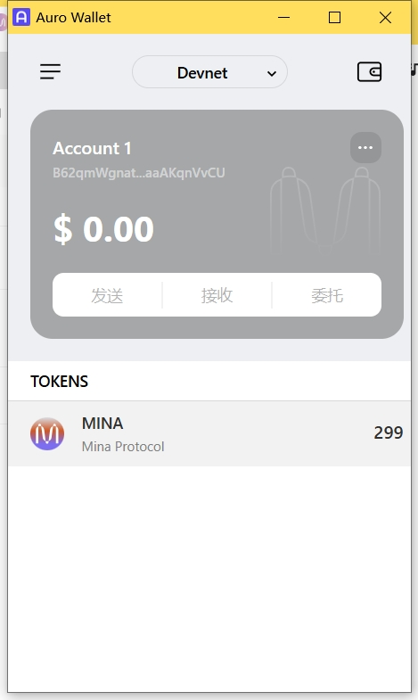

# task1：创建 auro wallet 账户，完成水龙头领水
## 1.概述Mina所采用的证明系统(包括名称、特点)
* Mina所采用的证明系统
  * 基于zkSNARK（zero-knowledge Succinct Non-interactive ARgument on Knowledge 零知识简洁的非交互式知识论证）的PLONK及其变种
  * 特点
    * 简化的可信设置（simplified trusted setup）：PLONK算法只需要一次初始设置（Universal Trusted Setup）；Mina’s Kimchi无需Trusted Setup!
    * 递归 zkSNARK（recursion zkSNARK）：生成的证明可以被入参
    * 通用 ZKP（general-purpose zkp）：更加灵活
    * 较小的证明（small proof size）：
  
## 2.概述递归零知识证明在 Mina 共识过程中的应用
1. validate a batch of Tx;    ->  generate TxBatchProof
2. construct new Block_i based on Tx Batch & lastBlock’s hash   ->  generate BlockProof_i  (including verify TxBatchProof  internally)
3. generate ChainProof_i  based on ChainProof_i -1  & BlockProof_i 
* Each ChainProof_i  means : The Whole Chain History from GenesisBlock to Block_i  is Valid.
 
## 3.下载安装 Auro wallet，创建账户，并完成领水
*  
* Tx Hash: 5Jtpx5WSdGrb4d2kaqPPHrMTF3fmvVKs7a1DtT5WNwWi6uT6sHc7
