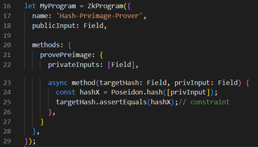
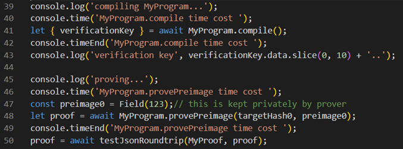
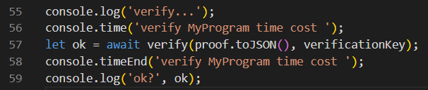

## 1.o1js
* o1js 是一个 TypeScript 库，用于：
  * 编写通用零知识（zk）程序
  * 为 Mina 编写 zk 智能合约
* o1js是启动zk应用程序的最快方法.

## 2.zkApp CLI
* 通过 zkapp-cli 命令行工具可以快速初始化工程脚手架，以及应用最佳实践
* 必备条件
  * NodeJS v18 及更高版本
  * NPM v10 及更高版本
  * git v2 及更高版本
* 安装zkApp CLI
```
npm install -g zkapp-cli
```

* 确认安装成功
```
zk --version
```

* 更新zkApp CLI
```
npm update -g zkapp-cli
```

* 创建项目
```
zk project <project-name>
# Create an accompanying UI project too? · nuxt
Which package manager would you like to use?  · npm
```

## 3.DSL语法
1. Field
   * Field是ZK编程中的基本数据单位
```
const sum = new Field(1).add(new Field(3))
# 等同于典型的编程中  const sum = 1 + 3
# 简化为  const sum = new Field(1).add(3)
```

2. 数据类型

| 数据类型 | 描述 |
| --- | --- |
| Bool(x) | true or false |
| Field(x) | 整数 |
| UInt64(x) | 64位无符号整数 |
| UInt32(x) | 32位无符号整数 |
| PrivateKey, PublicKey, Signature | 适用于账户和签名 |
| Group(x, y) | 椭圆曲线 |
| Scalar | 标量字段 |
| CircuitString.from('some string') | 最大长度为 128 的字符串 |
| Poseidon | 哈希函数 |

```
let x = new Field(4); // x = 4
x = x.add(3); // x = 7
x = x.sub(1); // x = 6
x = x.mul(3); // x = 18
x = x.div(2); // x = 9
x = x.square(); // x = 81
x = x.sqrt(); // x = -9

let b = x.equals(8); // b = Bool(false)
b = x.greaterThan(8); // b = Bool(true)
b = b.not().or(b).and(b); // b = Bool(true)
b.toBoolean(); // true

let hash = Poseidon.hash([x]); // takes array of Fields, returns Field

let privKey = PrivateKey.random(); // create a private key
let pubKey = PublicKey.fromPrivateKey(privKey); // derive public key
let msg = [hash];
let sig = Signature.create(privKey, msg); // sign a message
sig.verify(pubKey, msg); // Bool(true)
```

3. o1js 不支持传统的条件语句(If-else),支持三元运算符
```
const x = Circuit.if(new Bool(foo), a, b); // behaves like `foo ? a : b`
```

## 4.Demo
* Case：如何在不泄露原文的情况下证明你知道下面的哈希值的原文？ targetHash0 = '7316390958668495944925151659350747554661900395277588947710114819309740684320'
  * step 1:  编写零知识电路：
    
  * step 2:  Prover编译电路生成PK & VK，执行电路并传入preImage和targetHash参数，生成证明proof, 
    
  * step 3:  验证者验证proof,
    
  
* Proof 对象的结构：
```
{   
  "publicInput": Feild[], // 电路method的公开入参
  "publicOutput": Field[], // 电路method的返回值
  "maxProofsVerified": Integer, // 电路method中验证的proof的个数，在当前版本最大为2个
  "proof": binary type, // proof本身，二进制形式
}
```

* 一个完整的zkProgram的结构：
```
{
  "name": string,    
  "publicInput": AnyType, // 电路method的公开入参, 可选, only one
  "publicOutput": AnyType, // 电路method的返回值, 可选, only one
  "methods": {
    customeMethodName0: {
      privateInputs: AnyType[], // 当前method的私有入参，必选，允许是空数组
      async method(publicInputType, ...privateInputs){
        // ...constraints...
        // return, if "publicOutput" is defined.
      }
    },
    customeMethodName1: {
      privateInputs: AnyType[], // 当前method的私有入参，必选，允许是空数组
      async method(publicInputType, ...privateInputs){
        // ...constraints...
        // return, if “publicOutput” is defined.
      }
    }
  }
}
```

## 5.学习资源
1. [zkapp-cli 文档](https://docs.minaprotocol.com/zkapps/writing-a-zkapp/introduction-to-zkapps/install-zkapp-cli)
2. [Demo](https://github.com/coldstar1993/mina-sz)