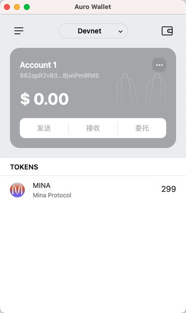

# Task 1: Mina Protocol 学习笔记

## 1. Mina的证明系统

Mina采用了名为Kimchi的零知识证明系统,这是一个基于PLONK的定制证明系统,具有以下特点:

- **递归证明能力**: Kimchi通过与Pickles递归系统的集成,支持无限递归证明构建
- **高效验证**: 验证时间恒定,与计算规模无关
- **轻量级**: 生成的证明大小固定,约22KB
- **可组合性**: 证明可以被组合和重用,支持模块化开发

## 2. 递归零知识证明在Mina共识中的应用

Mina创新性地将递归零知识证明应用于区块链共识过程:

1. **区块链压缩**
- 使用线性递归证明将无限增长的区块链压缩为恒定大小(~22KB)
- 新节点只需验证最新的SNARK证明,无需下载和验证完整链历史

2. **交易批处理**
- 使用树形递归证明并行压缩区块内的交易
- 多个交易可以被合并成单个证明,提高吞吐量

3. **状态转换验证**
- 每个新区块的状态转换都通过递归证明验证
- 确保状态更新的正确性,同时保持轻量级特性

## 3. 账户信息

- 钱包地址: B62qpR2vB3fNGXE4a5ACiCvcX9rKaLgUnQGT993xrCSi1BjwiPm9fM5
- 账户截图:

- 水龙头领取交易哈希: [5JuNDGhPTKV3FZ4tCkjpUHnRxd4uV93Z7oLBYMBeQdCoQA24sSPS](https://minascan.io/devnet/tx/5JuNDGhPTKV3FZ4tCkjpUHnRxd4uV93Z7oLBYMBeQdCoQA24sSPS)

## 参考资料
1. [Mina Protocol官方文档](https://minaprotocol.com/)
2. [Kimchi证明系统文档](https://docs.minaprotocol.com/)
3. [递归zkRollups介绍](https://minaprotocol.com/blog/recursive-zkrollups-hazook)
