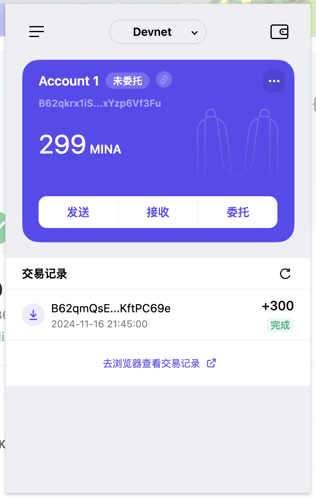

## task1：创建 auro wallet 账户，完成水龙头领水

### 1. 概述Mina所采用的证明系统(包括名称、特点)

Mina 的原始实现基于 zk-SNARK，采用了 Groth16 作为其证明系统。有简洁性、零知识、非交互性、可递归性和安全性。

### 2. 概述递归零知识证明在 Mina 共识过程中的应用

应用：
- 区块链的压缩
- 轻量级节点的快速验证
- 降低储存需求
- 去中心化和安全性
- 快速链同步

### 3. 下载安装 [Auro wallet](https://www.aurowallet.com/download/)，创建账户，并完成[领水](https://faucet.minaprotocol.com/)

请提交回答，钱包账户截图和领水 `tx hash`。

tx hash: 5JuBQqAb2HEHN29fZ3KtzEXmQ5ndVZ8vXrYRdEhoLy56Ds2GzVE1

