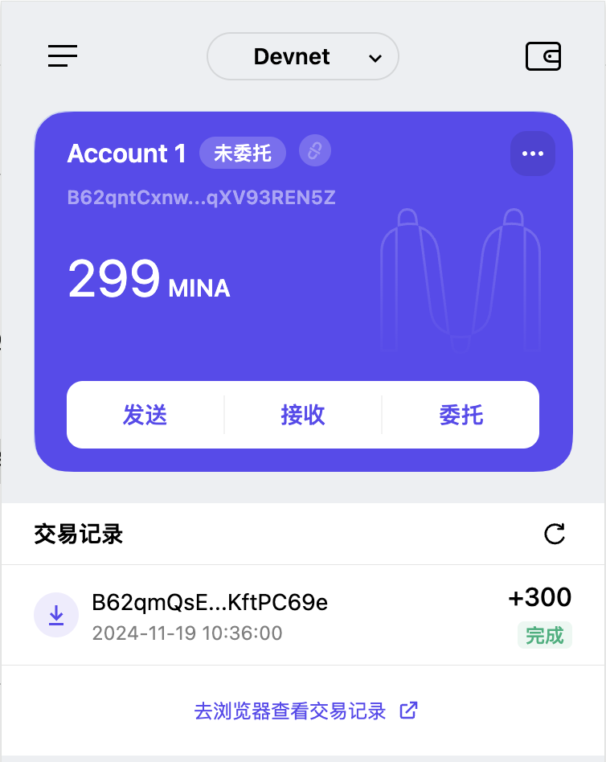

1. 概述 Mina 所采用的证明系统(包括名称、特点)
   Mina Protocol 采用了一种名为 zk-SNARKs 的证明系统,具有简洁性，非交互式，知识论证，可信设置，高效性特点。

2. 概述递归零知识证明在 Mina 共识过程中的应用

- 区块链压缩
  Mina 使用递归零知识证明，将所有历史区块的验证状态压缩成一个小的 zk-SNARKs 证明。无论区块链多长，验证者只需下载这个递归证明来验证整个区块链的有效性。
- 共识过程优化
  节点无需下载完整区块链，仅需验证递归证明就可以确认网络的最新状态，新节点加入，只需要下载一个几百字节的 zk-SNARK 证明而非全部历史数据。
- 高效的去中心化
  普通设备可以轻松参与 Mina 网络，减少中心化倾向。
- 可扩展性与性能
  每笔交易产生的状态变化通过 zk-SNARK 证明递归地合并到区块链状态中，即使有大量交易，验证成本保持低于常数时间。
- 数据隐私保护
  用户可以通过 zk-SNARKs 隐藏交易的具体内容，仅暴露必要的验证信息。支持身份认证，保护隐私。

3. 下载安装 Auro wallet，创建账户，并完成领水
   请提交回答，钱包账户截图和领水 tx hash。
   
   tx hash: 5JuNmhosSDjSAmn2RqNDv2BVgtVApYDNgBCft68rZ9ZNSQ3arrvN
