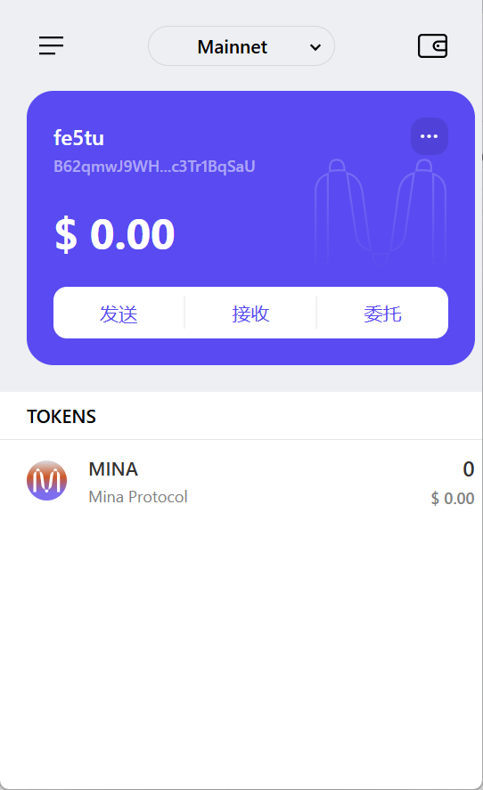

### task1：创建 auro wallet 账户，完成水龙头领水

1. 概述Mina所采用的证明系统(包括名称、特点)

   Mina采用的Zero Proof System是Kimchi，他是基于PLONK算法的变种，而PLONK又是zkSNARK的一个分支家族。其特点有：

   1. simplified trusted setup：`trusted setup` 是一种初始化设置，PLONK算法相比于传统的zkp以及Groth16，极大简化了该初始化仪式，只需要一次初始化设置。而Mina采用的Kimchi无需初始化设置。
   2. recursion zkSNARK：可递归的零知识证明极大的降低了链上验证的负担，提高了效率，同时减小了mina验证所需的体积。
   3. general-purpose zkp：mina的zkp更灵活。
   4. small proof size：生成的证明更小更轻便，在这点上略逊于Groth16。

2. 概述递归零知识证明在 Mina 共识过程中的应用

   在POS共识过程中，递归zkp主要起到**优化网络通讯**和**压缩节点体积**的作用。在构建新节点 **i** 时，除了生成该节点 **i** 的证明**Proof_i**，还会生成从初始节点Block_0到该节点前一节点Block_i-1的证明，即生成一个**ChainProof_i**，只需要**Proof_i**与**ChainProof_i**两个证明就能满足证明服务的需要，从而免去逐个检查之前所有节点的证明工作，减少网络通讯负担，压缩节点体积。

3. 下载安装 [Auro wallet](https://www.aurowallet.com/download/)，创建账户，并完成[领水](https://faucet.minaprotocol.com/)

   钱包账户截图：

   

   领水记录：https://minascan.io/devnet/tx/5JtceAiLyNHtz5hoFW2jJNZoG7kPnqbzWy6xXtBxi1xUFGFHPJJm

   领水 `tx hash` ：5JtceAiLyNHtz5hoFW2jJNZoG7kPnqbzWy6xXtBxi1xUFGFHPJJm

