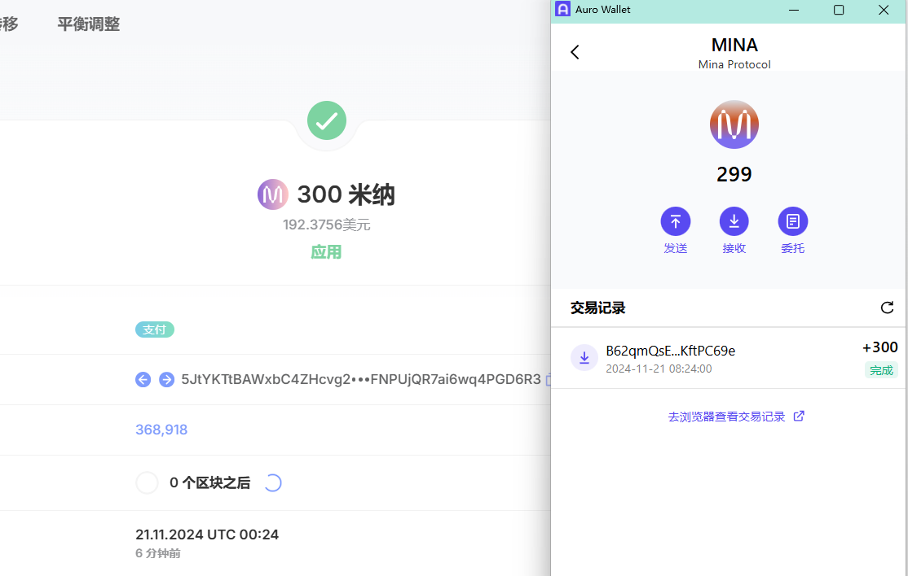

## task1：创建 auro wallet 账户，完成水龙头领水

1. **概述Mina所采用的证明系统(包括名称、特点)**

- 名称：Mina协议采用的证明系统是zk-SNARKs（Zero-Knowledge Succinct Non-Interactive Argument of Knowledge）
- 特点：
    1. 简洁性和高效性：证明大小极小（几百字节），验证时间快速，与被证明的计算量大小无关，适合资源受限设备;zk-SNARKs 的计算效率较高，适用于需要频繁生成和验证证明的应用场景。
    2. 零知识性:证明者无需透露具体计算过程或输入数据，即可让验证者确信计算结果的正确性。
    3. 非交互性:一次性生成的证明可以被任何验证者独立验证，无需证明者和验证者之间的反复交互。

2. **概述递归零知识证明在 Mina 共识过程中的应用**
   
递归零知识证明（Recursive Zero-Knowledge Proofs）在 Mina 协议中主要用于优化区块链的存储、验证效率以及节点同步。其核心应用包括以下几个方面：

- 1.压缩区块链状态 
Mina 利用递归零知识证明，将整个区块链历史交易和状态压缩为一个固定大小的证明。这种压缩过程通过递归嵌套的形式，每一层证明都验证上一层的有效性，并输出一个新的证明。 通过递归计算，所有交易和历史状态的正确性最终被表示为一个恒定大小的证明（约 22KB）。
参与者只需下载并验证最新的递归证明，无需处理完整的区块链历史。
- 2.快速节点同步 
递归零知识证明使 Mina 的区块链保持恒定大小，降低了存储需求和计算开销。 新加入的节点只需同步最新的证明即可成为完整节点，而不需要下载和验证从创世区块到当前区块的所有数据。这种轻量化设计显著提升了 Mina 网络的去中心化程度，允许更多用户参与网络。
- 3.高效验证 
递归证明将多层证明的验证整合为一个过程： 每一层证明验证上一层证明的有效性，最终生成一个嵌套证明链。
在共识过程中，每个新区块不仅生成当前交易的零知识证明，还生成递归证明，用于验证整个区块链的完整性。
- 4.隐私保护 
递归零知识证明保留了零知识特性，即验证链的状态合法性时无需透露交易细节。这确保了用户隐私，同时保持了验证的透明性和安全性

### 3. 完成钱包+领水
1. 领水 tx hash `5JtYKTtBAWxbC4ZHcvg26v8BnCMDTF6TFNPUjQR7ai6wq4PGD6R3`
2. 钱包账户截图

