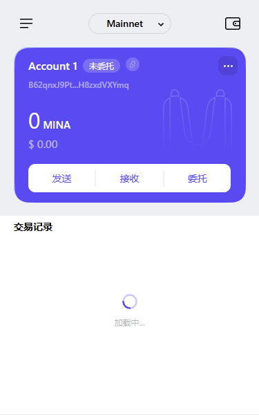

## task1：创建 auro wallet 账户，完成水龙头领水
1. 概述Mina所采用的证明系统(包括名称、特点)
Mina协议采用的证明系统是零知识递归零知识证明（zk-SNARKs，Zero-Knowledge Succinct Non-Interactive Argument of Knowledge）。
这一证明系统的核心特点包括：

- 零知识证明：zk-SNARKs允许一方（证明者）在不透露具体信息的情况下，向另一方（验证者）证明自己知道某个秘密或满足某个条件。在Mina协议中，使用零知识证明来验证区块链的状态，而无需暴露具体交易数据。

- 递归性：zk-SNARKs在Mina协议中具有递归特性。区块链的每个新块都生成一个证明，这个证明又可以被进一步证明，形成一个递归结构。这使得整个区块链的状态可以通过非常简洁的证明来验证，而不需要存储或传输整个历史数据。

- 简洁性：Mina协议的主要优势之一就是它保持区块链非常小只有22kB。传统区块链可能随着交易量增加而膨胀，但由于zk-SNARKs的使用，Mina区块链的大小几乎保持不变，且足够小到可以被普通智能手机运行。

- 非交互性：zk-SNARKs的验证过程不需要证明者和验证者之间的多次互动，而是在一次性生成的证明中完成，这对于分布式网络尤其重要，减少了延迟和复杂度。
Mina的零知识递归证明系统使得它能够高效且轻量地运行，并且通过证明方式增强了隐私性和安全性。

2. 概述递归零知识证明在 Mina 共识过程中的应用
递归零知识证明在 Mina 共识过程中的应用，关键在于利用 zk-SNARKs（零知识简洁非交互式论证）的递归特性来有效地验证区块链状态，而不需要存储整个区块链的所有历史数据。能够让Mina能够保持区块链的大小几乎恒定，且确保在保证区块链安全性、去中心化和隐私性的同时，使得整个区块链的状态和历史验证变得高效、简洁，解决了传统区块链面临的可扩展性问题。

3. 下载安装 Auro wallet，创建账户，并完成领水

tx hash: 5JureEYam2GQw2Hff4oMsM1iJDAHjsssuNcrGhUFgrCixuG7VaJP

请提交回答，钱包账户截图和领水 tx hash。