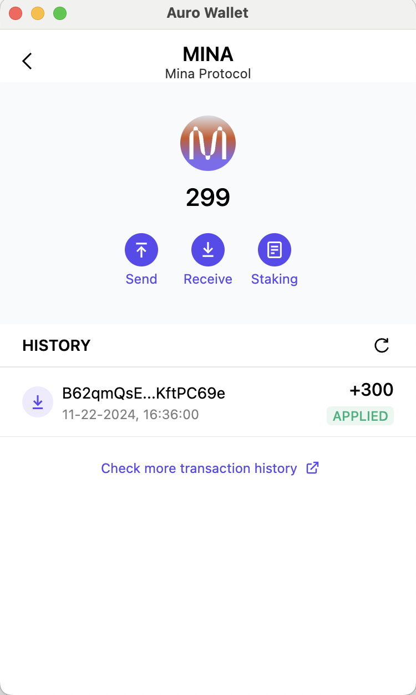

## Task 1

> 参考资料：https://z.cash/learn/what-are-zk-snarks/

### 概述Mina所采用的证明系统

Mina所采用的是[zk-SNARK](https://z.cash/learn/what-are-zk-snarks/)证明系统,它具有以下特点：
- **零知识性（Zero-Knowledge）**:可以在不透露任何信息的情况下，证明某个信息的持有。
- **非交互式（Non-Interactive）**:zk-SNARK 证明仅需一次性生成和验证，无需证明者与验证者多次通信。
- **简洁性（Succinct）**:可以在几毫秒内完成验证，且生成的证明体积较小。

### 概述递归零知识证明在 Mina 共识过程中的应用

递归零知识证明在Mina共识过程中的应用主要体现在其高效性和隐私保护上。Mina使用的递归零知识证明，可以使区块链的大小保持在极小的水平，从而确保任何人都可以轻松验证整个区块链的有效性，不需要下载整个区块链，就能验证交易和状态。且不需要透露具体的交易细节。递归零知识证明在Mina共识过程中的应用，使得区块链更加轻量级和隐私友好，允许用户以更低的成本参与网络，同时保持交易的安全性和有效性。

### Wallet & TX Hash

`5JtsPbymDL3qiCGMJH3f89EwFUVvxeYjHQHEu1XZiWcSnd4G1rQJ`

