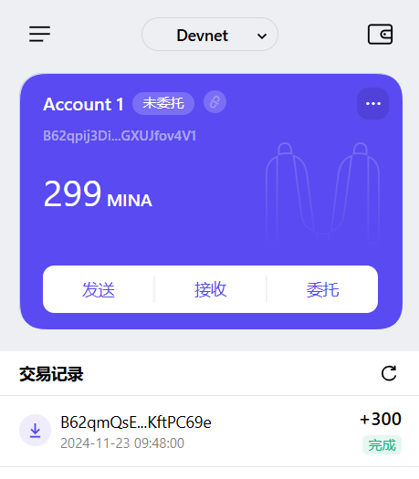

### task1：创建 auro wallet 账户，完成水龙头领水

1. 概述Mina所采用的证明系统(包括名称、特点)

概述：
Mina 采用了一种名为 ZK-SNARKs 的零知识证明系统，实现的方式是开发团队优化的 Recursive zk-SNARKs（递归零知识简洁非交互知识论证），是世界上最轻量级的区块链，其零知识证明特性不仅确保了更好的隐私保护，还显著提高了验证效率，可以应用在更多的 web3 应用场景中。
特点：
- 零知识特性（证明者无需透露任何输入的实际数据，不需要公开所有交易细节，从而增强隐私保护。）
- 简洁性（证明文件非常小同时也就让验证耗费的时间少）
- 非交互性（证明者只需生成一次证明，验证效率具有高效性）
- 递归性
- 超轻节点
- 计算高效性（计算压缩的过程体现了计算上的高效性）
- 区块链压缩

2. 概述递归零知识证明在 Mina 共识过程中的应用

概述：主要的应用有以下几个方面：链状态压缩、验证高效、提高区块链可扩展性、新区块生成和验证、轻节点和浏览器兼容性

3. 下载安装 [Auro wallet](https://www.aurowallet.com/download/)，创建账户，并完成[领水](https://faucet.minaprotocol.com/)

请提交回答，钱包账户截图和领水 `tx hash`。

tx hash : 5JtjkUKkBaC7xqiQZwBkgt7F8tYfG9D6CzXNfArCDrH2BkQDa5w9

截图：

