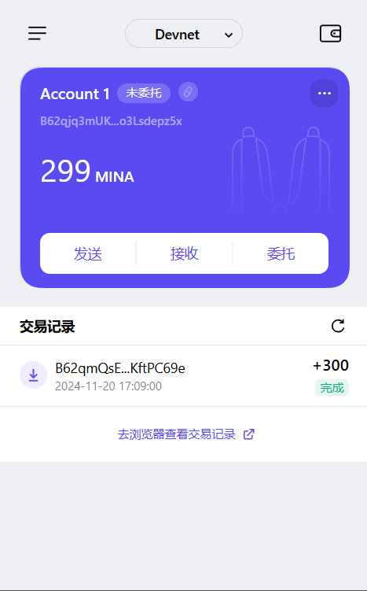

### task1：创建 auro wallet 账户，完成水龙头领水

1. 概述Mina所采用的证明系统(包括名称、特点)
    - 名称 ：  
      - Mina采用了Kimchi一种专为高性能区块链定制的zkSNARK实现。
  
    - 特点 ：
        - 零知识  
        证明者可以向验证者证明某个命题的真实性，无需暴露任何实际数据。例如，在Mina中通过这种方式保护交易的隐私，只需证明交易的有效性而不公开具体内容。
        - 简洁性  
        生成和验证证明文件的大小非常小（仅几百字节），验证时间通常在毫秒级别。这是Mina实现“恒定大小区块链”的关键技术之一。
        - 非交互性  
        证明过程通常是单向且无需多次交互，验证者可以独立完成验证工作。这极大地提升了网络效率，特别适合去中心化环境。
        - 知识论证
        证明者不仅证明命题的真实性，还证明自己掌握相关信息。这种特性为Mina的链上操作提供了可信保障。
        - 无需可信设置  
        突破了传统zkSNARK需要可信设置的限制，进一步增强了系统的安全性和去中心化程度。
        - 支持无限递归  
        通过递归零知识证明技术高效处理证明的生成与验证过程，性能不随链的增长而下降。这是实现恒定链大小的关键技术创新。
        - 优化性能
        针对区块链场景进行了特别的优化，满足高并发环境下的性能需求。  

  
2. 概述递归零知识证明在 Mina 共识过程中的应用
    - 隐私保护  
    在Mina中，递归零知识证明被用于验证交易的有效性而不暴露实际数据，实现匿名投票、隐私交易等操作，保护用户的数据安全。
    - 计算压缩  
    利用递归零知识证明技术将区块链扩容至 Layer1-Mina 和Layer2-zkRollup 等层面上的应用场景；每个新区块包含自身证明及历史递归 证明；通过递归证明原理$（Proof(n) -> Proof(n-1) -> ... -> Proof(0））$，最终实现单一证明文件包含全链状态。
    - 区块链大小的恒定性  
    Mina通过递归零知识证明技术将整个区块链压缩为约22KB，无论网络历史多么庞大；节点只需验证最新的零知识证明而不必存储完整的链数  据，从而极大地减少了存储需求和验证时间。  

3. 下载安装 [Auro wallet](https://www.aurowallet.com/download/)，创建账户，并完成[领水](https://faucet.minaprotocol.com/)

请提交回答，钱包账户截图和领水 `tx hash`。

- 领水 `tx hash`  
    5JusgRVYRgkNa953yz6TptaTAZfFk99muVPr5qkth7BUGmYbvDVy
- 钱包账户截图  
    