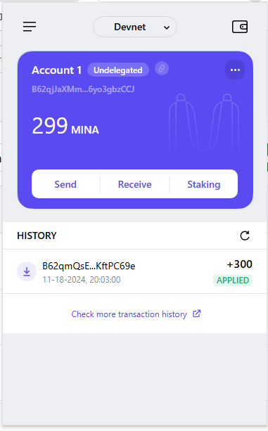

### task1：创建 auro wallet 账户，完成水龙头领水

1. 概述 Mina 所采用的证明系统(包括名称、特点)

    Mina Protocol 采用了一种名为 递归零知识证明（Recursive zk-SNARK）的证明系统。这个系统具有以下特点：

    - 递归特性 ~ 无需每次都存储整个交易历史
    - 轻量级 ~ Mina 的验证节点只需要 22 KB
    - 去中心化 ~ 任何人都可以轻松地运行全节点
    - 安全性 ~ 零知识证明的数学基础提供了高水平的安全性
    - 隐私保护 ~ 在不暴露具体数据的情况下验证交易的有效性

2. 概述递归零知识证明在 Mina 共识过程中的应用

    - 区块生成 ~ 创建一个新的区块时，会生成一个新的递归证明，证明新交易的有效性以及新生成区块的状态改变
    - 轻量验证 ~ 每个区块都可以通过前一个区块的证明递归地进行验证，确保整个链的有效性
    - 简化节点要求 ~ 任何用户都可以轻松运行 Mina 节点

3. 下载安装 [Auro wallet](https://www.aurowallet.com/download/)，创建账户，并完成[领水](https://faucet.minaprotocol.com/)

    钱包账户截图: 

    领水 `tx hash`: https://minascan.io/devnet/tx/5JtwK1GDgXUbxPrxVxAiWCMhnXZ3cYh5EMNYwhNAHc6K3ZiphjQC
