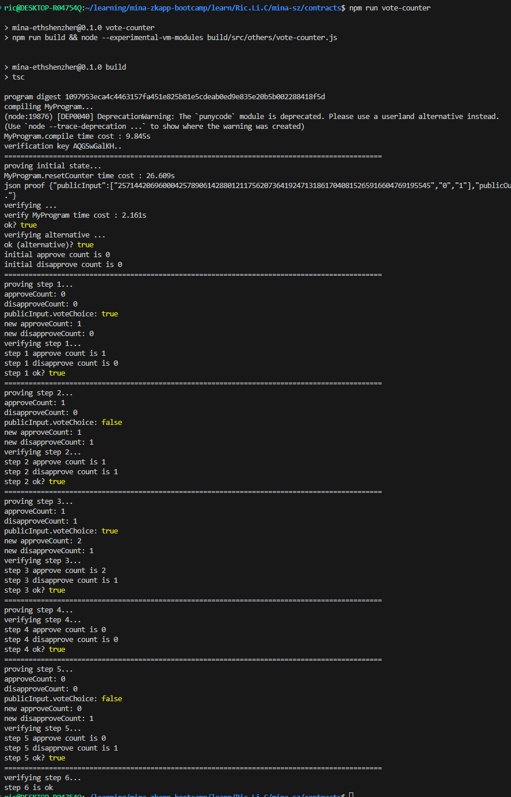

### task2： 设计一个简单的投票统计器

1. 设计一个简单的投票统计器用于小团队内部投票，要求能累积统计出赞成票和反对票的票数
2. 考虑检查投票者属于团队成员，假设队员不会重复投票

请提交测试执行脚本。

### 作业

-   测试执行脚本(简单验证): [vote-counter_simple.ts](vote-counter_simple.ts)

-   测试执行脚本(默克尔树验证): [vote-counter_merkle.ts](vote-counter_merkle.ts)

-   测试运行截图: 
