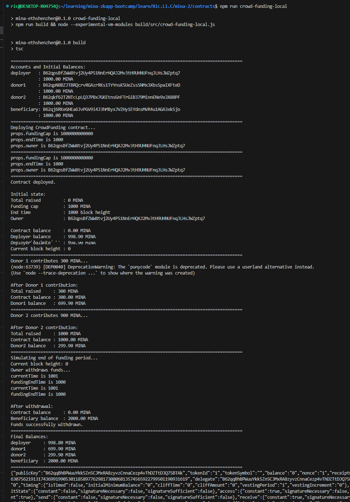

### task3： 设计一个众筹合约, 时间窗口关闭后被投资人方可提款

1. 运用 `zkapp-cli` 命令行工具初始化工程
2. 使用 `o1js` 设计一个众筹合约，在指定时间窗口间允许任何人投入 MINA，有硬顶
3. 时间窗口关闭后被投资人方可提款

请提交提供 `Jest` 本地测试的交互脚本，以及部署到 `DevNet` 的 `tx hash`。

### 作业

-   众筹合约: [CrowdFunding.ts](CrowdFunding.ts)

-   本地测试的交互脚本: [CrowdFunding.test.ts](CrowdFunding.test.ts)

-   测试运行截图: 

-   部署到 `DevNet` 的 `tx hash`:
