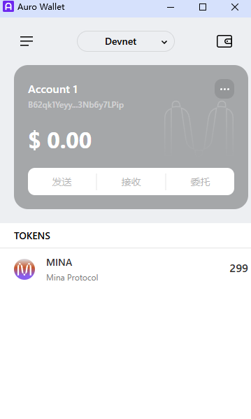

# 第一章：Mina 协议基础
### 概述Mina所采用的证明系统(包括名称、特点)

Mina使用零知识证明。
证明者能够在不向验证者提供任何有用信息的情况下，使验证者相信某个论断正确。
具有隐私保护、验证高效、计算压缩的特点。
零知识证明属于概率性证明，并非数学上严谨证明。

#### 两种零知识证明
- 交互式零知识证明
证明者和验证者需要同时在线。证明者面对每个验证者都要证明一次数据的真实性。

- 非交互式零知识证明 
证明者和验证者无需同时在线。证明者创建一份证明，任何使用这份证明的人都可以进行验证。

#### 零知识证明系统
- 前端系统：负责电路开发语言规范，算术化编译等
- 后端证明系统：负责生成证明和验证证明

### 概述递归零知识证明在 Mina 共识过程中的应用
Mina 通过递归零知识证明将链压缩至22KB，使得可以在一个手机、一个网页里轻松运行和验证区块链，无需担心数据膨胀带来的存储压力。具有低资源需求、高效同步、快速启动、减少传输带宽的特点。

每一个block可以证明前一个区块的合法，这样对于每一个区块，从genesis区块开始到它之间都是合法的。通过一个区块就可以等同于全节点的验证。

### 下载安装 Auro wallet，创建账户，并完成领水
领水tx hash 5Juo9unpevHh1EiiFrGKheimLVDuEXBt4ZEQrRDT1FYoeaXtJNBu
