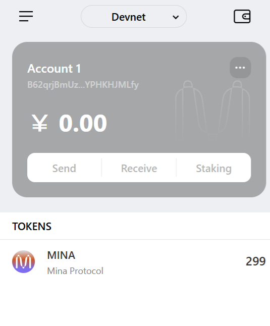

1. 概述 Mina 所采用的证明系统(包括名称、特点)
   Mina 的原始实现基于 zk-SNARK，采用了 Groth16 作为其证明系统。有简洁性、零知识、非交互性、可递归性和安全性。

2. 概述递归零知识证明在 Mina 共识过程中的应用
   应用：

区块链的压缩
轻量级节点的快速验证
降低储存需求
去中心化和安全性
快速链同步

3. 下载安装 Auro wallet，创建账户，并完成领水
   请提交回答，钱包账户截图和领水 tx hash。
   5JvFkaejQ4KvwnpdiCnZBFxu75ZsGdN895AaFJmc4FG1LfcGcms1
   
