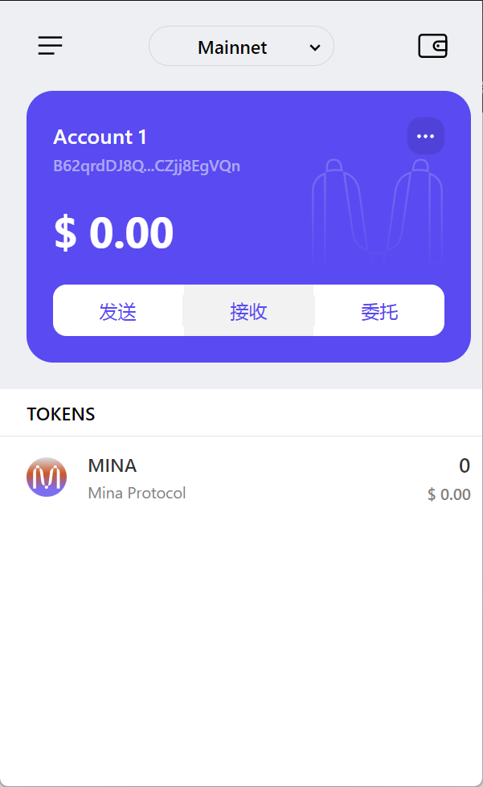

# task1

### 概述Mina所采用的证明系统(包括名称、特点)

Mina所采用的证明系统的名称是：**Pickles**，其特点如下：

- **递归零知识证明**：通过采用递归结构的零知识证明，Mina 构建了一个强大的证明系统，使其能够仅需验证最新区块的合法性即可保证所有区块的合法性，从而大大提高了效率和安全性。
- **通用性**：可以适用于各种区块链和智能合约。
- **高效性**：实现高性能的证明和验证，减少了区块链的验证时间和资源消耗。

### 概述递归零知识证明在 Mina 共识过程中的应用

- 递归零知识证明使其能够仅需验证最新区块的合法性即可保证所有区块的合法性
- Mina的体积并不会像传统区块链那样面临区块数据膨胀的问题，而是一直保持在22kb
- 普通用户也可以轻松运行全节点，极大的提升了区块链网络的去中心化程度

### 钱包账户截图和领水 *tx hash*。

Devnet领水的tx hash：`5Jtewm8tB7RX5CaQs2ZvqWxTtrVu4yXftCmnPnegrtSSBQReet9J`

钱包截图：