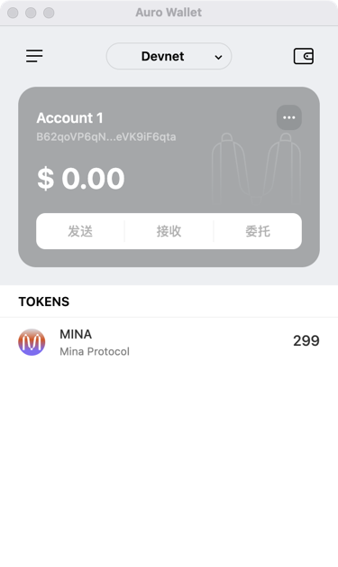

### task1：创建 auro wallet 账户，完成水龙头领水

1. 概述 Mina 所采用的证明系统(包括名称、特点)
2. 概述递归零知识证明在 Mina 共识过程中的应用
3. 下载安装 [Auro wallet](https://www.aurowallet.com/download/)，创建账户，并完成[领水](https://faucet.minaprotocol.com/)

请提交回答，钱包账户截图和领水 `tx hash`。

1. 零知识证明
- Private (私密性):
    - 验证者可以验证证明的正确性,但无法获知任何关于原始数据的信息, 保护了证明者的隐私, 只暴露必要的验证结果

- Truthless (无真值性):
    - 证明者不需要提供关于被证明陈述真实性的任何信息, 验证过程不依赖于具体的真值,而是基于数学关系

- Efficient (高效性):
    - 证明的生成和验证过程计算复杂度较低, 可以快速完成大规模数据的验证

- Decentralized (去中心化):
    - 不需要可信第三方参与, 任何人都可以独立验证证明的正确性

2. Mina 使用递归零知识证明将整个区块链压缩成一个固定大小的证明（约 22kb）, 每个新区块都会生成一个新的递归证明, 这个证明包含了之前所有区块的信息, 新的验证者可以在毫秒级完成验证  
    ***验证过程:***  
    a. 验证者收集 tx, 通过验证电路生成一个 TxBatchProof  
    b. 基于 tx batch 和父区块的 hash 生成新的区块, 在验证电路生成 BlockProof_i, 其中包含 TxBatchProof  
    c. 基于 ChainProof_i-1 和 BlockProof_i 生成新的 ChainProof_i(包含了整条链的历史是有效的, 例如从 batch0 到 batch1的有效性可以用ChainProof_1证明, 从 batch1 到 batch2的有效性可以用ChainProof_2证明)   
    d. 验证者可以通过验证电路验证 ChainProof_i 的正确性  

3. 5JuaRg3eaTYyNoHJy7LxvHjFJo6aJ57ikqFZvvaSVX3Qn2FLH3fH  
   
