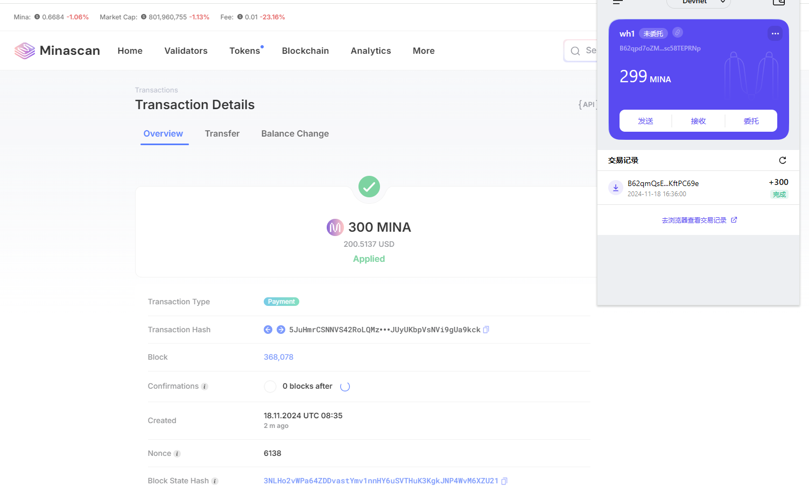

1. 概述 Mina 所采用的证明系统(包括名称、特点)

> Mina 是一个轻量级的区块链协议，它采用了一种独特的证明系统 —— 零知识证明，特别是递归零知识证明。

- 名称：
  - 零知识证明（Zero-Knowledge Proof，ZKP），具体为递归零知识证明（Recursive Zero-Knowledge Proof）。
- 特点：
  1. 零知识证明：zk-SNARKs 允许一个证明者向验证者证明某个陈述是真实的，而无需透露任何额外的信息。换句话说，验证者可以确信某个陈述的真实性，但不会获得关于该陈述的任何细节。
  2. 简洁性：递归零知识证明允许将多个证明压缩成一个单一的、固定大小的证明。无论区块链的长度或交易数量如何增长，验证者只需验证一个相对较小的证明，大大降低了存储和验证成本。
  3. 非交互性：zk-SNARKs 是非交互的，这意味着证明者和验证者之间不需要多次通信。证明者可以一次性生成证明并发送给验证者，验证者可以独立验证该证明。

---

2. 概述递归零知识证明在 Mina 共识过程中的应用

   1. 区块生成：在 Mina 中，每个区块的生成者需要创建一个包含该区块内所有交易有效性证明的递归零知识证明。这个证明不仅涵盖了当前区块的交易，还包括了对之前所有区块状态的验证，从而确保了整个区块链历史的一致性。
   2. 共识验证流程：网络中的其他节点在验证新区块时，只需验证这个单一的递归零知识证明，而无需重新验证整个区块链的历史交易。尽管区块链不断增长，但是证明的大小始终不变，避免了传统区块数据膨胀的问题。
   3. 状态更新：递归零知识证明还用于更新区块链的全局状态。通过验证证明，节点可以快速确定新的区块链状态，而无需重新计算整个状态转换过程，提高了系统的可扩展性和响应速度。

---

3. 创建账户并且领水

- tx hash: [5JuHmrCSNNVS42RoLQMzM3wVbkQ8j4XkJUyUKbpVsNVi9gUa9kck](https://minascan.io/devnet/tx/5JuHmrCSNNVS42RoLQMzM3wVbkQ8j4XkJUyUKbpVsNVi9gUa9kck)

