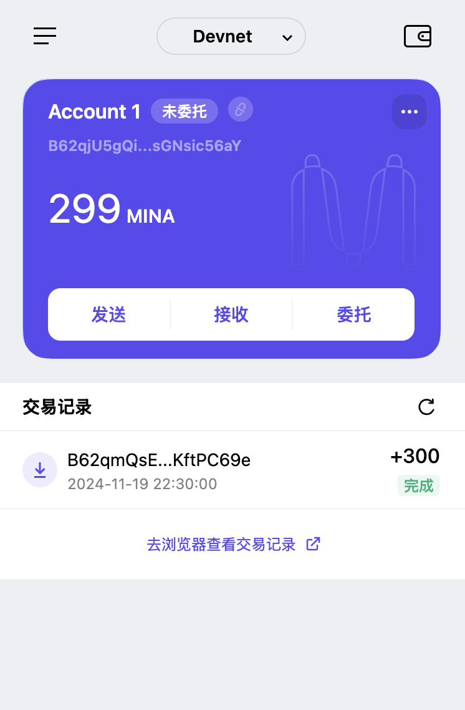

### task1：创建 auro wallet 账户，完成水龙头领水

1. 概述Mina所采用的证明系统(包括名称、特点)

> - 名称：zk-SNARKs(Zero-Knowledge Succinct Non-Interactive Argument of Knowledge) | 零知识简洁非交互式知识论证
> - 特点：零知识性、简洁性、非交互式、知识论证

2. 概述递归零知识证明在 Mina 共识过程中的应用

> 应用：区块链压缩、隐私性增强、高效验证

3. 下载安装 [Auro wallet](https://www.aurowallet.com/download/)，创建账户，并完成[领水](https://faucet.minaprotocol.com/)

> 
>
> [tx hash: 5JukfB3Eq34sJ6yajpetxHjduWvJ9NwTYSCiDoxzQPUNM79Fw4SY](https://minascan.io/devnet/tx/5JvKKyRtUKaCfLvz96GnwWtDzNnud75Z4RL5yK59qtpzFqNQgazD)

