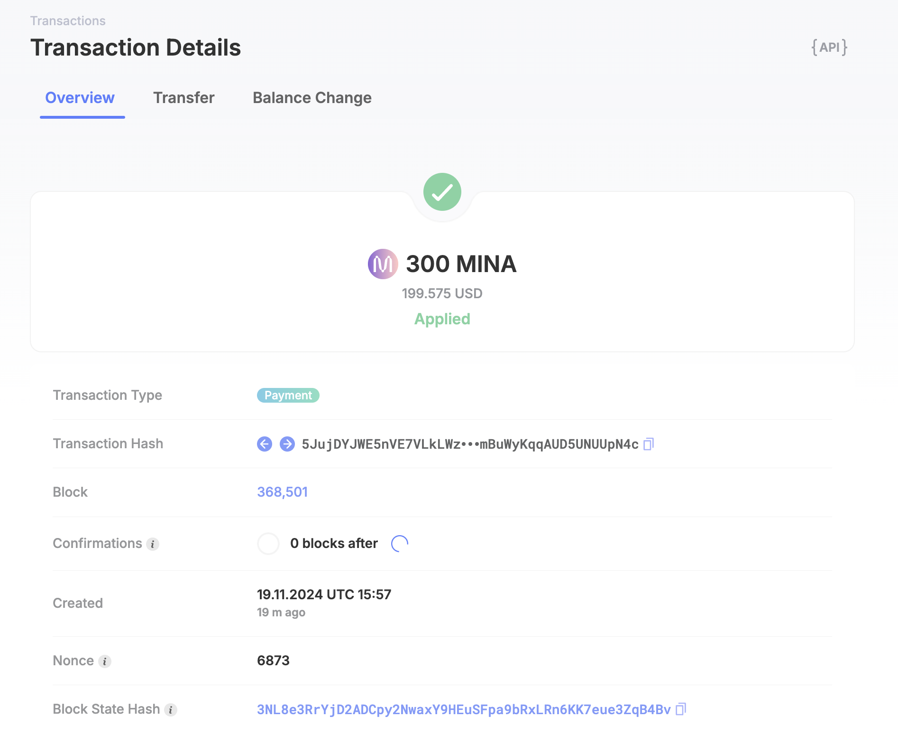

# Mina zkApp 训练营 - Task 1
## 1. 概述Mina所采用的证明系统(包括名称、特点)

- Mina 所采用的证明系统是 Kimchi.
- Kimchi 的特点
  - Kimchi 是 PLONK 的一个变体，但进行了深度优化，以便更好地支持递归证明和高性能验证：
  - Kimchi 引入了 Halo 2 的递归证明技术，允许生成者在区块链上证明前一个证明的有效性，从而实现递归。
  - Kimchi 支持批量证明和批量验证，这对于区块链中处理多个交易和区块验证非常重要。

##  2. 概述递归零知识证明在 Mina 共识过程中的应用
- Mina 的核心理念：固定大小的区块链

    Mina 的创新点在于通过递归零知识证明，保持整个区块链的状态大小恒定约为 22 KB，无论链的历史多长。传统区块链需要完整节点存储整个区块链历史，而 Mina 仅需存储最新状态的递归证明即可验证整个链的有效性。

- 递归 zk-SNARK 的作用

    递归 zk-SNARK 是 Mina 轻量级区块链的技术核心，其主要作用如下：

    - 验证历史区块：Mina 不直接存储所有的区块数据，而是通过递归 zk-SNARK 技术将区块链历史压缩成一个单一的证明。每个新区块在生成时，会基于前一区块的证明生成一个新的 zk-SNARK 证明，使得链的所有历史信息被递归证明包含在最新的证明中。

    - 压缩共识验证：每个新区块的生成者不仅需要证明区块的有效性，还需要递归验证之前所有区块的证明，从而将整个区块链的验证成本压缩为常数级别。这种递归证明的结果允许任意节点快速验证整个链的完整性，无需下载和存储所有的区块历史。

    - 简化轻节点同步：传统区块链中的轻节点需要与全节点交互以同步区块头，但 Mina 的轻节点仅需下载最新的 zk-SNARK 证明即可完成同步，极大地降低了同步成本。

- 递归零知识证明在共识过程中的具体应用

    Mina 协议采用的是 Ouroboros Samasika 共识机制（基于 Ouroboros 的变体），递归零知识证明贯穿整个过程：

    - 新区块的生成与验证：区块生产者在生成新区块时，构造包括交易数据、区块头和前一区块证明在内的递归证明，确保新区块不仅合法，还能递归验证整个链的合法性。这种递归机制使得验证新区块变得高效，任何节点只需验证最新证明即可确认整条链的有效性。

    - 交易隐私性与轻量性：Mina 支持的 zk-SNARK 证明可以应用于交易隐私性中，但其更大的作用是减少验证成本，使得验证链上的交易无需下载完整交易历史。

    - 提高共识效率：在共识过程中，节点无需重复验证从创世块到当前块的所有信息，而是通过最新的递归证明快速验证整个区块链状态。这大大降低了参与共识的计算负担和时间延迟。

- 递归零知识证明的优势

    在 Mina 的共识过程中，递归零知识证明带来了以下显著优势：

    - 极小的存储需求：链的验证只需一个递归证明，无需存储完整区块历史。
    - 高效验证：验证成本恒定，无论链的历史有多长。
    - 轻节点友好：轻节点可以快速加入网络并同步状态，无需依赖全节点。
    - 可扩展性：即使交易量增加，也不会显著影响链的大小和验证效率。

## 截图

tx hash: 5JujDYJWE5nVE7VLkLWziR1tZTkJNyo3mBuWyKqqAUD5UNUUpN4c