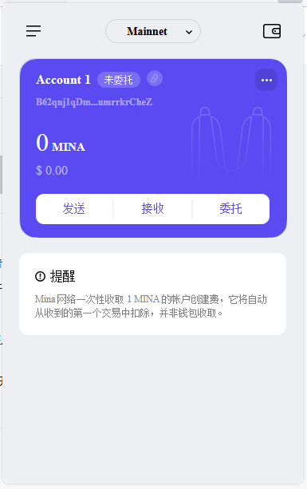

### task1：创建 auro wallet 账户，完成水龙头领水

1. 概述Mina所采用的证明系统(包括名称、特点)

名称: Kimchi

特点：
- 非交互性
- 零知识

2. 概述递归零知识证明在 Mina 共识过程中的应用

- 快速验证
- 递归证明
- 隐私安全

3. 下载安装 [Auro wallet](https://www.aurowallet.com/download/)，创建账户，并完成[领水](https://faucet.minaprotocol.com/)

请提交回答，钱包账户截图和领水 `tx hash`。

tx hash：
5JuamqxAoui66hq2UHUJ16eEuY6XTf9jcBUnF26T3JehTnejzzU9