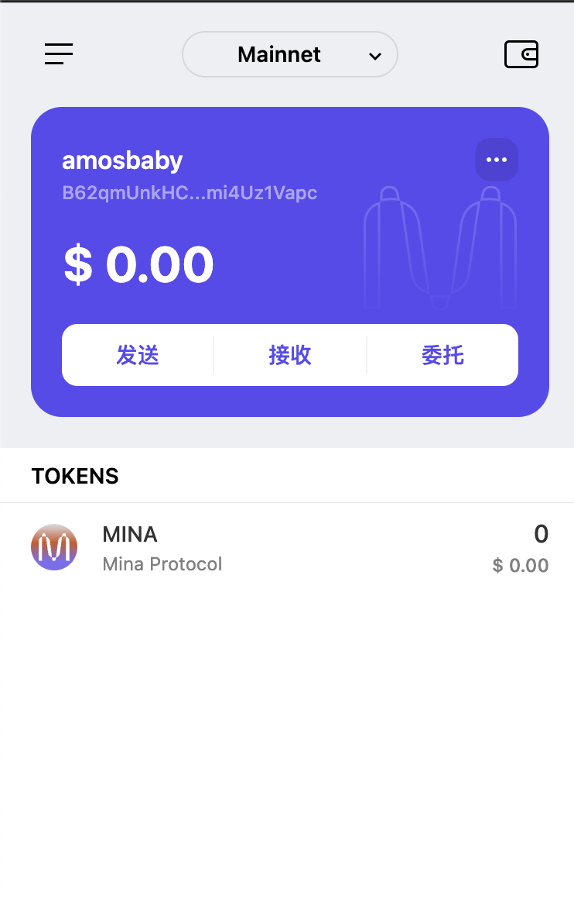
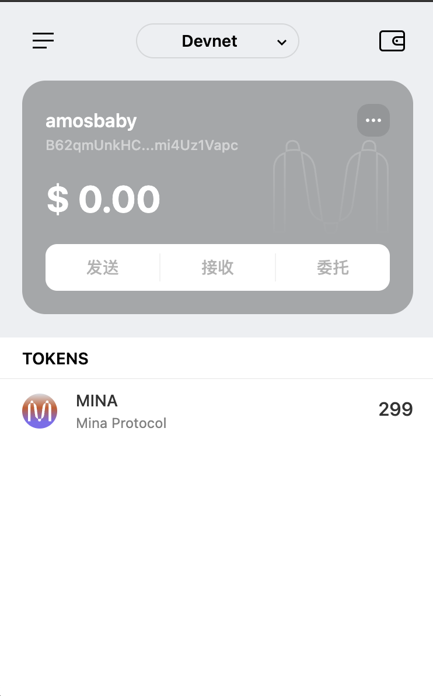

### 概述 Mina 所采用的证明系统(包括名称、特点)
 名称: zk-SNARK (Zero-Knowledge Succinct Non-Interactive Argument of Knowledge). 零知识简洁非交互性证明.
 特点: 采用递归 zk-SNARK, 将区块链中所有历史交易压缩为单个简洁证明, Mina 链始终保持 22KB 大小!

### 概述递归零知识证明在 Mina 共识过程中的应用
  1. 将整条区块链的完整性和有效性都被压缩到一个小型 zk-SNARK 证明中.
  2. 节点同步快, 毕竟只有 22kb, 下载和验证速度都比较快.
  3. 门槛低, 也就让更多人更容易参与, 大大降低了中心化的程度.

### 领水

Transaction Hash: 5JuTop1Cdmgvbzfm9mfiQ9wS4pzHnxx6mGDrHvSGGDVCak9brya9
