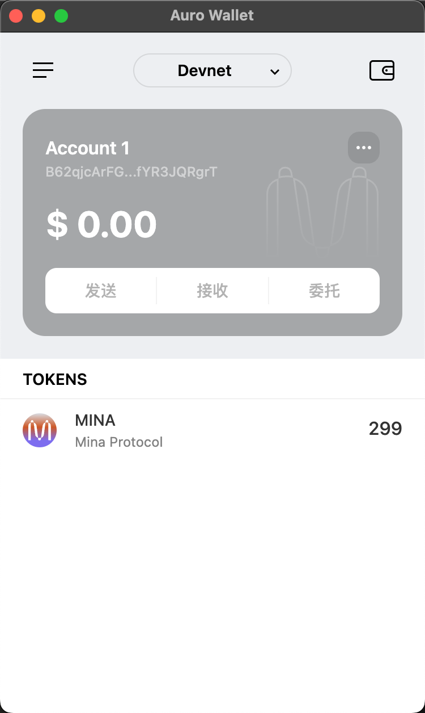

### task1：创建 auro wallet 账户，完成水龙头领水

1. 概述Mina所采用的证明系统(包括名称、特点)

- Mina 采用的是 Kimchi 证明系统，它是 Mina 基于 zkSNARK 系统中的 PLONK 作为基础构建而成。

- **特点:**
  * Kimchi 无需 Trusted Setup 

  * 递归零知识证明
  
  * 高效性与轻量性, 完整链大小固定 22KB
  
  * 结合Kimchi多项式承诺方案

2. 概述递归零知识证明在 Mina 共识过程中的应用

- 轻量级存储，链状态被压缩为固定大小，无需完整存储交易历史。

- 隐私保护，零知识特性隐藏交易细节，仅验证其合法性。

- 高效验证，新节点只需验证最新的递归证明即可加入网络。

3. 下载安装 [Auro wallet](https://www.aurowallet.com/download/)，创建账户，并完成[领水](https://faucet.minaprotocol.com/)
- **领水交易哈希**
5JuyKwCUVRTWSCDEquR4Nfkg6FgVTzX9hu6hAv6HMEUwaHF64Crf

- **钱包地址**
B62qjcArFGA3XGB2z4E21jZw7H2rKgRzmDHivvAbZQMT3fYR3JQRgrT

请提交回答，钱包账户截图和领水 `tx hash`。

