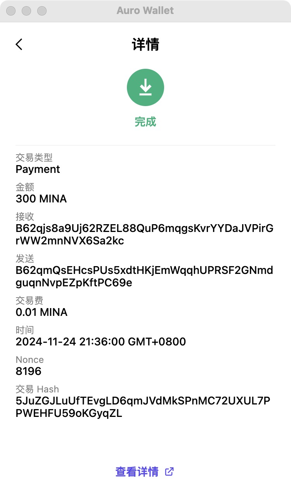

## task1：创建 auro wallet 账户，完成水龙头领水

### 1. 概述Mina所采用的证明系统(包括名称、特点)

Mina协议使用了zk-SNARKs（Zero-Knowledge Succinct Non-Interactive Arguments of Knowledge），是一种零知识证明系统
零知识性：证明者可以向验证者证明某个声明的真实性，而无需透露任何额外信息。
简洁性（Succinctness）：生成的证明大小非常小，验证速度快，适合资源受限的环境。
非交互性（Non-Interactive）：验证过程无需多轮交互，通常只需要一个证明即可完成验证。
通用性：可以用于各种计算，不局限于特定的数学问题。
高效性：zk-SNARKs在生成和验证证明时的计算资源需求低。

### 2. 概述递归零知识证明在 Mina 共识过程中的应用
递归证明
状态压缩
轻量化存储
高效性
去中心化增强

### 3. 下载安装 [Auro wallet](https://www.aurowallet.com/download/)，创建账户，并完成[领水](https://faucet.minaprotocol.com/)

请提交回答，钱包账户截图和领水 `tx hash`。

tx hash: 5JuZGJLuUfTEvgLD6qmJVdMkSPnMC72UXUL7PPWEHFU59oKGyqZL

