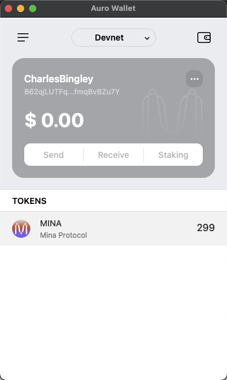

- 概述 Mina 所采用的证明系统(包括名称、特点)
  - Mina 是基于 zk-SNARKs 的递归证明技术
  - 特点是轻量、递归证明、隐私性
- 概述递归零知识证明在 Mina 共识过程中的应用
  - Mina 的零知识证明仅需一个证明就可以验证区块链的正确性，无需下载整个链

- Transaction Hash
5JuZMgtEUK7qCRmKQ2qKUPVQVMfiduDUUSLHwn3GeWPmt5ZVVt1d

