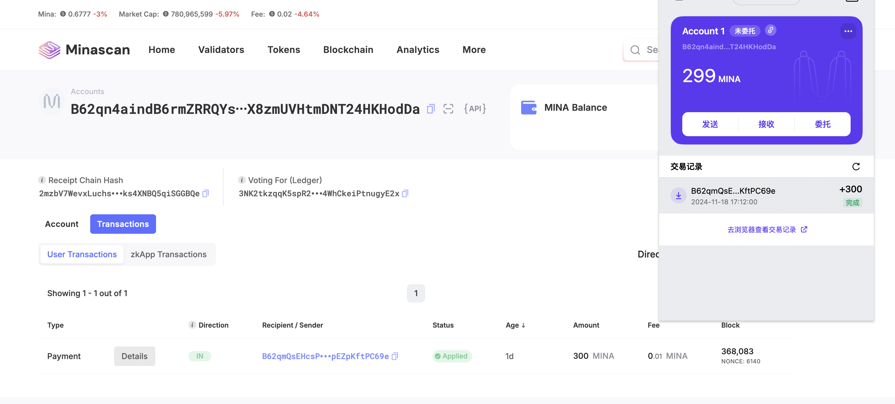

1.概述Mina所采用的证明系统(包括名称、特点)

Mina 采用的证明系统主要为 **递归零知识证明** (Recursive Zero-Knowledge Proofs)

递归证明 支持并发 零知识安全 固定大小证明

2.概述递归零知识证明在 Mina 共识过程中的应用

新区块的生成与证明 链的压缩验证 共识过程的轻量化

钱包地址：B62qn4aindB6rmZRRQYsPEkyYtUpe3Rm2XX8zmUVHtmDNT24HKHodDa
交易 hash
5Jup22h9p4GGsax7j1FKvuzWkN2X8FgWYn5dy99Tg3k7eYVHvxJT

