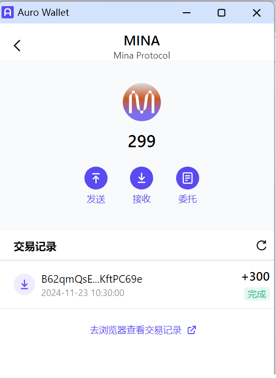

# Mina x OpenBuild zkApp 训练营

| 任务 | 阶段 | 名称 | 奖励 |
|-------|-------|-------|-------|
| [task1](./task/task1.md) | 第一周 | 创建Auro wallet账户，完成水龙头领水 | ￥15 |
| [task2](./task/task2.md) | 第二周 | 设计一个简单的投票统计器 | ￥35 |
| [task3](./task/task3.md) | 第三周 | 设计一个众筹合约，时间窗口关闭后被投资人方可提款 | ￥15 |
| [task4](./task/task4.md) | 第四周 | 设计一个众筹合约，众筹资金逐步释放 | ￥15 |
| [task5](./task/task5.md) | 第四周 | 发行你自己的 token，然后设计一个众筹合约 | ￥35 |
| [task6](./task/task6.md) | 第五周 | 运行一个 appchain | ￥21 |

## 1. task1
- tx hash: 5JufW5x2fbBBwxNanxtGaExtAXsby8fQoLARJzGEx7ajw7U7uTpT
  

