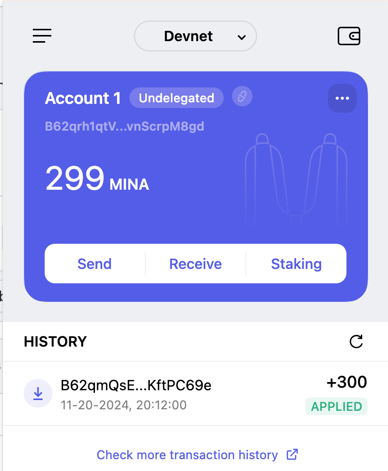

### task1：创建 auro wallet 账户，完成水龙头领水

1. 概述Mina所采用的证明系统(包括名称、特点)
Mina 使用无限递归零知识证明来创建 22KB 区块链，用于证明任何事物并启用隐私优先的应用程序。

2. 概述递归零知识证明在 Mina 共识过程中的应用
- 保持去中心化，避免状态膨胀而造成的中心化趋势。
- 解决隐私和可扩展性
- 能够存储价值，低成本的无需许可的交易。

3. 下载安装 [Auro wallet](https://www.aurowallet.com/download/)，创建账户，并完成[领水](https://faucet.minaprotocol.com/)

请提交回答，钱包账户截图和领水 `tx hash`。

tx hash:
5JuGGLDSvheNrvxQFCRdpMRumUuu2LNm5sKXAqYWyQ8GnDZ237os

