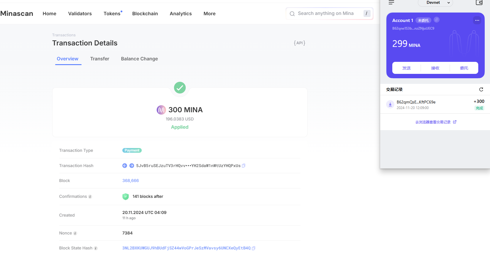

### task1：创建 auro wallet 账户，完成水龙头领水

#### 创建 Auro wallet 账户，完成水龙头领水
- 官网：https://www.aurowallet.com/download/ (包含 Chrome、Edge、Firefox、Android、iOS 客户端或插件)
#### 第一章：Mina 协议基础
- Mina 和 开发者Grant 计划
- 零知识证明入门
- Mina 22kb 原理
- Mina 开发者资源

### 1. 概述Mina所采用的证明系统(包括名称、特点)
> - Kimchi，
> - 特点：无需 trusted setup，成本相对低; recursion zkSNARK，递归零知识证明；general-purpose zkp，灵活; small proof size。

### 2. 概述递归零知识证明在 Mina 共识过程中的应用
> - 区块压缩，22 kb。
> - 新节点加入只需下载最新区块，实现毫秒极验证。
> - 简洁非交互式的零知识证明，隐私保护，验证高效。
### 3. 下载安装 Auro wallet，创建账户，并完成领水

- tx hash:
5JvB5ruSEJzuTV3rHQvvCiRf7yRVooEyYH2SdaW1nWtUzYHQPxUs