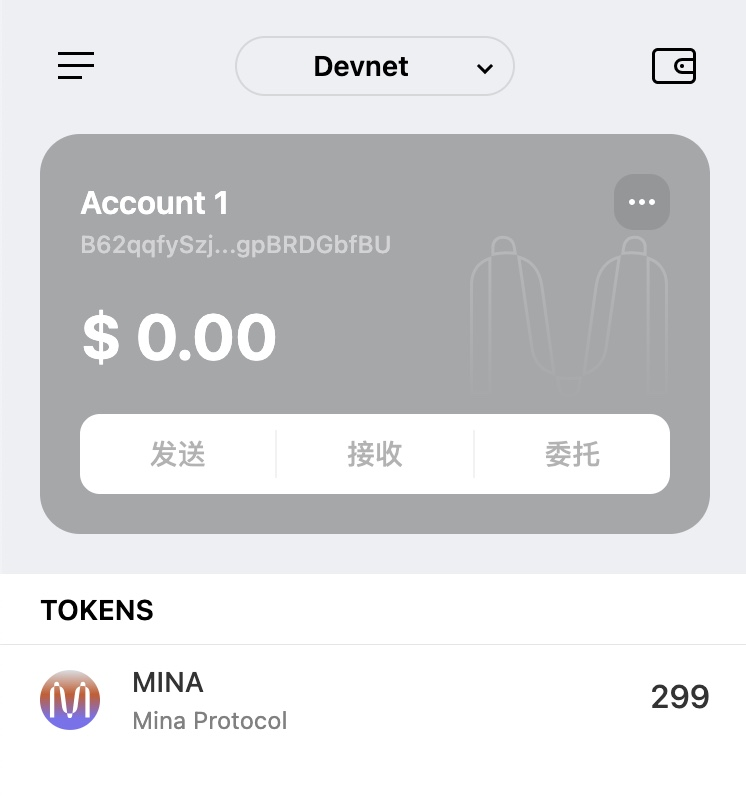

## task1：创建 auro wallet 账户，完成水龙头领水

### 1. 概述Mina所采用的证明系统(包括名称、特点)

采用了基于 zk-SNARK的kimchi

特点： 
- 保护隐私，
- 密码学保证验证证明的合法性和有效性
- 验证高效
- 去中心化，无需Trusted Setup

### 2. 概述递归零知识证明在 Mina 共识过程中的应用

应用：
- 将整条区块链的完整性和有效性都被压缩到一个小型 zk-SNARK 证明中
- 节点同步快, 毕竟只有 22kb, 下载和验证速度都比较快
- 门槛低, 能让更多人更容易参与, 大大降低了中心化的程度

### 3. 下载安装 [Auro wallet](https://www.aurowallet.com/download/)，创建账户，并完成[领水](https://faucet.minaprotocol.com/)

请提交回答，钱包账户截图和领水 `tx hash`。

tx hash: 5Juov7wUnSYMbTRpAyDNzuPoTvDayjpF3yEyq5tB4geNVteiJDNb

