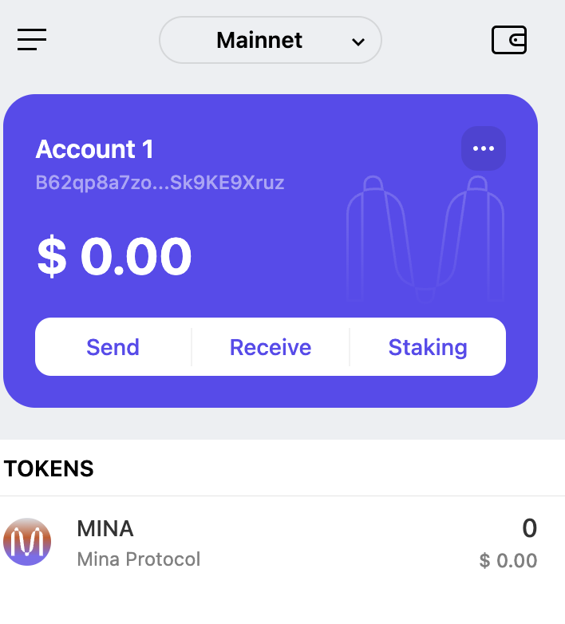

# Task 1

## 1. M概述Mina所采用的证明系统(包括名称、特点)

Mina区块链所采用的证明系统名为Kimchi。

### 特点
1. 递归证明：Kimchi允许Mina区块链保持约22KB的固定大小，通过递归零知识证明技术实现。
2. 基于PLONK：Kimchi基于PLONK系统，这是一个由Ariel Gabizon、Zachary J. Williamson和Oana Ciobotaru于2019发布的证明系统。
3. 灵活性：Kimchi具有15个“columns”，解锁了更多的灵活性，能够处理椭圆曲线点操作，提升了性能。
4. 优化操作：包括“外部字段”的优化操作，使得Mina的证明系统能够处理EVM签名、bn128/bn254证明等。
5. 查找功能：支持随机访问数组、高效的范围检查等，简化了电路的创建。
6. 分块电路：Kimchi现在可以“分块”电路，证明比以往更大的电路。

## 2. 概述递归零知识证明在 Mina 共识过程中的应用

递归零知识证明在 Mina 共识过程中扮演了关键角色，主要体现在以下几个方面：

1. **状态转换系统的证明**：
   - Mina 将区块链视为一个状态转换系统，其中每个状态转换（即区块）需要被证明是有效的。
   - 使用递归零知识证明（SNARKs）来验证这些状态转换的有效性。

2. **增量计算**：
   - 为了确保区块链的可扩展性，Mina 采用了增量计算的 SNARKs。这意味着每次添加新区块时，只需计算与新增交易相关的证明，而不是重新计算整个区块链的历史。
   - 这种方法显著减少了计算开销，使得验证过程更加高效。

3. **证明结构**：
   - Mina 的 SNARK 证明结构包括基础证明（base proof）、包装证明（wrap proof）和合并证明（merge proof）。
   - 基础证明用于验证单个状态转换。
   - 包装证明用于将基础证明嵌入到更大的证明结构中。
   - 合并证明用于将多个包装证明合并成一个更大的证明。

4. **并行扫描状态**：
   - 为了进一步提高性能，Mina 引入了并行扫描状态技术。通过并行计算多个区块的 SNARK 证明，Mina 能够显著减少交易确认时间。
   - 这种技术通过维护一个工作队列来实现，队列中的每个元素代表需要进行的 SNARK 工作。

5. **共识协议**：
   - Mina 使用 Ouroboros Samasika 共识协议来确保区块链的安全性和一致性。
   - 该共识协议结合了递归 SNARKs，确保在验证过程中不需要依赖外部建议或信任第三方。

通过这些机制，Mina 实现了一个高效且可扩展的区块链系统，能够在不牺牲安全性的前提下，提供快速的交易验证和确认。

## 3. 下载安装 [Auro wallet](https://www.aurowallet.com/download/)，创建账户，并完成[领水](https://faucet.minaprotocol.com/)

请提交回答，钱包账户截图和领水 `tx hash`。

tx hash: 5JvEqzViFX4a64V22kvGCPmVziHC2ndwQH7h2jdghKt2ML7LjZ7r

