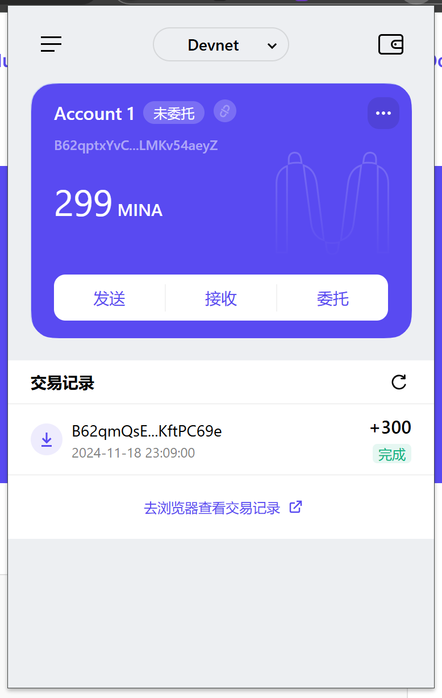

### task1：创建 auro wallet 账户，完成水龙头领水

1. 概述Mina所采用的证明系统(包括名称、特点)

- 名称：Kimchi (基于 zk-SNARKs 改造)
- 特点：
    1. 简洁性与高效性，无需可信的初始设置(Trusted Setup), 体积更小(small proof size);
    2. 递归证明能力：具有强大的递归特性(recursion zkSNARK)，允许将多个子证明组合成一个更高级别的证明。
    3. 适应性与灵活性: Kimchi 证明系统在设计上具有较高的适应性(general-purpose zkp)，可以根据不同的应用场景和需求进行定制和优化。

2. 概述递归零知识证明在 Mina 共识过程中的应用

```
Recursive ZKP:

Proofn  of  Proofn-1  of ... of  Proofi  of ... of  Proof0
Samples:
   circuit0() -> p0
   circuit1(p0) -> p1    // verify(p1)

   circuit2() -> p2
   circuit3(p1, p2) -> p3  // verify(p3) 
   ...
   ...

```
- 1. 逐步嵌套的证明结构：   
    Mina 协议中的递归零知识证明采用了多轮嵌套证明的形式。例如：
    circuit0() -> p0 生成第一个证明 p0。
    circuit1(p0) -> p1 使用前一个证明 p0 来生成下一个证明 p1，然后进行验证。
    继续进行更多层次的递归，每一层证明验证上一层的有效性，如 circuit2() 生成 p2，并通过 circuit3(p1, p2) 生成最终的证明 p3。

- 2. 递归证明的验证：    
    在每个步骤中，生成的证明都会通过 verify() 函数进行验证，确保每一轮证明的有效性。这使得 Mina 可以通过较小的计算和存储来验证整个区块链的历史和状态。
    在 Mina 共识中，每个新的区块生成者不仅生成当前交易的 zk-SNARKs 证明，还生成递归证明，验证过去的所有状态。

- 3. 区块链状态压缩：   
    Mina 利用递归零知识证明对整个区块链的状态进行压缩，最终将所有历史交易和状态压缩为一个固定大小的证明。这个证明在 Mina 网络中可以被不断验证，而无需存储整个区块链数据。
    这样，通过递归证明，Mina 实现了非常轻量化的验证机制，任何参与者都能轻松验证整个网络的状态，而无需下载大量数据。

- 4. 高效和隐私保护：    
    每一轮递归证明都能有效地减少计算量，并且由于零知识特性，用户的隐私能够得到保护——只有合法性被验证，而不需要透露交易的详细内容。


3. 下载安装 [Auro wallet](https://www.aurowallet.com/download/)，创建账户，并完成[领水](https://faucet.minaprotocol.com/)

- 钱包账户截图: 


- 领水 `tx hash`: `5Jtw2K4GY2o4WeJjGqjwCcb1Vzb2Zpeso2aq2uef4QoAjuVV1geZ`
