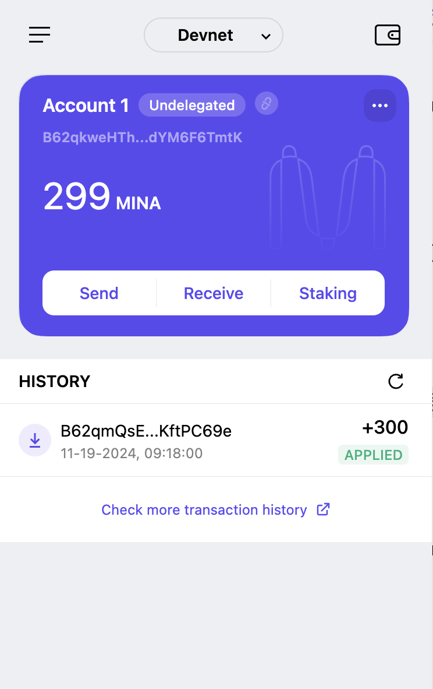

1. 概述Mina所采用的证明系统(包括名称、特点)

Mina 所采用的证明系统：zk-SNARKs?

特点：零知识证明、简洁、非交互、可扩展、安全

2. 概述递归零知识证明在 Mina 共识过程中的应用

递归零知识证明允许将多个交易的证明合并为一个单一的证明。

由于递归零知识证明的存在，Mina 的全节点可以在不需要存储整个区块链历史的情况下运行。

递归零知识证明确保每个新生成的区块都能验证前一个区块的有效性，从而增强了网络的安全性和一致性。

3. 下载安装 Auro wallet，创建账户，并完成领水

请提交回答，钱包账户截图和领水 tx hash。

5Jumd1owHpsGbai51svAzpXoSUGcEvkDsHM5GPDHGs3hwL2e6Bx5

