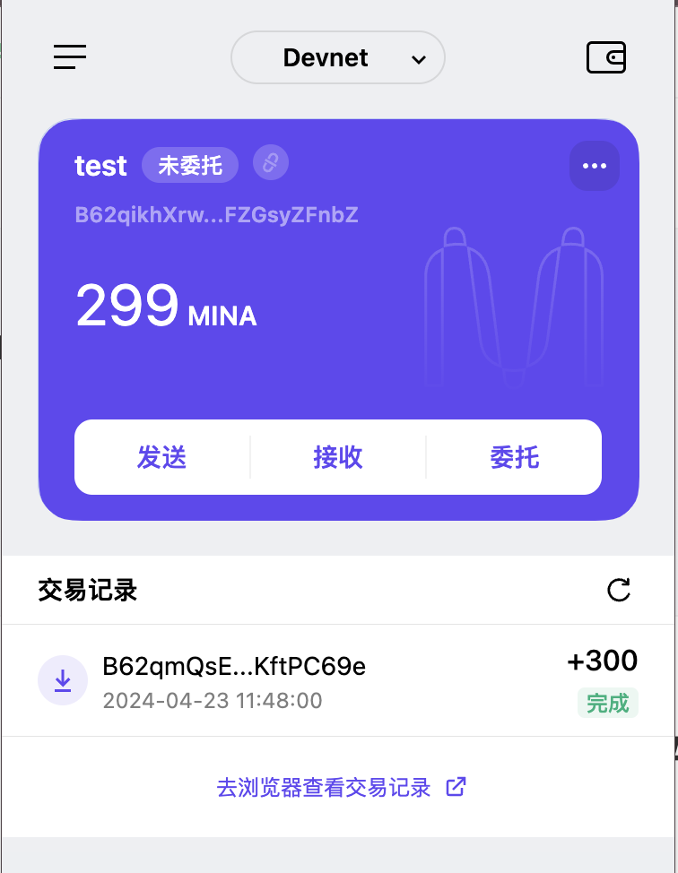

### task1：创建 auro wallet 账户，完成水龙头领水

1. 概述Mina所采用的证明系统(包括名称、特点)

Kimchi 证明系统是Mina采用的主要零知识证明系统，它具有以下特点：

#### 基本架构
- 是一个通用的零知识PLONK证明系统
- 基于PLONK架构
- 无需Trusted Setup
- 使用Rust语言实现

#### 技术特性
- 自定义门电路: 支持自定义约束系统
- 高效验证: 采用批处理技术提高验证效率
- 递归证明: 支持证明的组合和递归
- 通用性: 可以证明任意计算的正确性

#### 优化特点
- 并行化: 支持并行化证明生成
- 内存优化: 针对内存使用进行了优化
- 验证效率: 具有快速的验证时间

#### 实际应用
- 主要用于Mina区块链
- 支持zkApps（零知识智能合约）的执行
- 用于压缩区块链状态

2. 概述递归零知识证明在 Mina 共识过程中的应用

#### 基本原理
Mina 使用递归零知识证明主要是为了实现两个核心目标：
- 保持固定大小的区块链状态（约22KB）
- 允许快速验证整个链的历史

#### 在共识过程中的具体应用

##### 区块链状态压缩
- 证明链接：每个新区块不仅包含当前交易的证明，还包含之前所有状态的递归证明
- 状态更新：
  - 旧状态 + 新区块 → 生成新的递归证明
  - 新证明包含了整个链历史的有效性证明
  - 只需存储最新的证明，而不需要存储完整历史

##### 证明的递归特性
- 证明的证明：可以证明其他证明的有效性
- 压缩效果：多个证明可以压缩成单个固定大小的证明（22kb）
- 验证效率：只需验证最新的证明即可确认整个链的有效性

3. 领水截图

请提交回答，钱包账户截图和领水 `tx hash`。

- tx: 5JuFhPHmXhDezYSRTH5FVmQ1r4gKcjVQENDKtXHgcwEEhHLf5LFk

