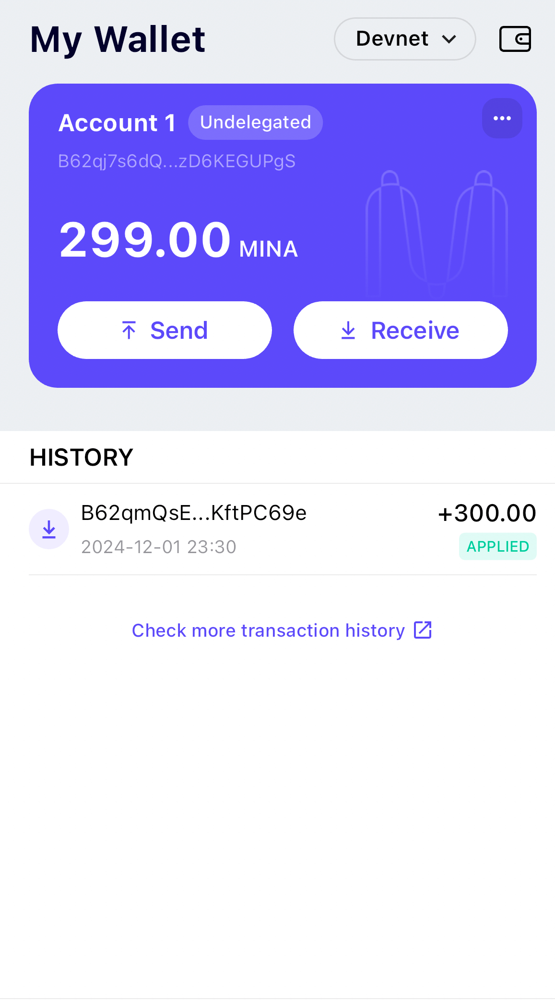

# Mina Bootcamp Task 1

## 概述Mina所采用的证明系统(包括名称、特点) Overview of Mina's proof system (including name, characteristics)

Name of Mina's proof system: Kimchi.

Kimchi is a variant of Plonk, a general purpose zero knowledge proof system to prove the correct execution of programs.  

Kimchi uses bulletproof style polynomial commitment in the protocol to address the trusted setup limitation of Plonk. The protocol could break if the participants are not honest. 

#### Arithmetic Circuits
Arithmetic circuits consist of arithmetic gates. List of gates can act on registers which are the inputs and outputs to verifiy instructions and bits. 

#### Characteristics of Kimchi

- Additional of 12 registers to the 3 registers Plonk has in the arithemetic circuits: allows gates to take in multiple inputs. Registers classified into IO registers and temporary registers. 

- Gates can write output directly on the register used by the next gate: useful for gates such as "poseidon" which is frequently used in a row. 

- Improvement in lookups: Kimchi builds table and allows gates to perform lookup into the table to fetch for the operation result. 

- Referring to https://www.o1labs.org/blog/reintroducing-kimchi, Kimchi can chunk a circuit and use Pickles ( recursion layer, protocol layer to create proofs of proofs ) to make these chunks into a single proof. 

## 概述递归零知识证明在 Mina 共识过程中的应用 Overview of the Application of Recursive Zero-Knowledge Proofs in the Mina Consensus Process.

Application of recursive zk proofs allows for verifying large amount of information on blockchain. The implementation of zkRollups and app chains are possible with recursive verification.

## 下载安装 Auro wallet，创建账户，并完成领水 Download Auro Wallet, create account
tx hash: 5JteG3NETiHKbJSZ65tMFohKWxHhXRTq66pBqUxps34n4ruwrKDx

