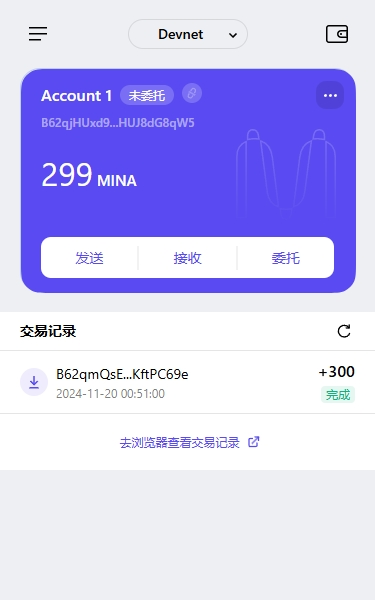

### task1：创建 auro wallet 账户，完成水龙头领水

### 1. 概述Mina所采用的证明系统(包括名称、特点)

#### 证明系统的名称：

zk-SNARKs（Zero-Knowledge Succinct Non-Interactive Argument of Knowledge，零知识简洁非交互知识证明）

#### 特点：

1. 零知识
zk-SNARKs 是一种零知识证明，意味着验证者可以确信某项声明是真实的，而无需知道任何关于声明的具体细节。这保证了 Mina 网络的隐私性。

2. 简洁性
zk-SNARKs 生成的证明非常小，验证起来也极为快速。这种简洁性使 Mina 的区块链可以保持恒定大小（约 22 KB），从而显著降低存储和同步成本。

3. 非交互性
zk-SNARKs 是一种非交互式证明协议，证明者只需生成一个单一的证明发送给验证者，无需多轮交互。这极大地提高了系统的效率和用户体验。

4. 基于密码学的安全性
zk-SNARKs 依赖于安全的密码学假设，例如椭圆曲线密码学和加密学中的通用信任假设，确保证明的真实性和防篡改性。

5. 全局一致性和轻量化
Mina 使用 zk-SNARKs 压缩整个区块链的状态，使得用户只需验证最新的 zk-SNARKs 而无需下载和存储完整区块链。这解决了传统区块链随着时间推移不断增长的问题，实现了所谓的“轻量化区块链”。

### 2. 概述递归零知识证明在 Mina 共识过程中的应用

递归零知识证明 是 Mina 协议的核心技术之一，极大地增强了其扩展性和效率。以下是递归零知识证明在 Mina 共识过程中的应用概述：

1. 压缩区块链状态

在 Mina 中，每个新区块都会生成一个新的 zk-SNARK 证明，用于验证当前区块的合法性。
通过递归零知识证明技术，新区块的证明会包含前一区块证明的验证结果，从而将整个历史链条压缩为一个单一且简洁的证明。
因此，区块链的状态可以保持恒定大小（约 22 KB），无论链条的历史长度如何。

2. 支持轻量级节点（Snarkified Blockchain）

用户运行 Mina 客户端时，仅需下载并验证递归 zk-SNARKs 的最新证明，而不需要同步或存储整个区块链历史数据。
这使得 Mina 成为“世界上最轻量的区块链”，使任何设备（如手机）都能作为完整节点参与网络。

3. 优化共识机制中的验证效率

Mina 的 Ouroboros Samasika 共识机制依赖于递归零知识证明，确保链的验证快速且可信。
验证者通过递归证明可以快速确认链的状态和区块的有效性，无需重新计算所有历史交易。

4. 增强系统的可扩展性

递归证明将网络的存储和计算需求最小化，使 Mina 可以支持大规模用户和更高的交易吞吐量，而不会对网络性能造成显著影响。
验证的递归性质确保即使在高负载下，系统也能维持去中心化和高效运行。

5. 提高隐私性

每个 zk-SNARKs 证明在递归过程中隐含地保护了交易和区块数据的隐私。验证者只需验证证明本身的正确性，而无需了解区块或交易的具体内容。

### 3. 下载安装 [Auro wallet](https://www.aurowallet.com/download/)，创建账户，并完成[领水](https://faucet.minaprotocol.com/)

请提交回答，钱包账户截图和领水 `tx hash`。

* 钱包账户截图

* 领水`tx hash`

`5JtfqAeh4wsKXTBNdEXB96VxnR12AQBx8qVkVrPDdHgRpz5GqWPg`