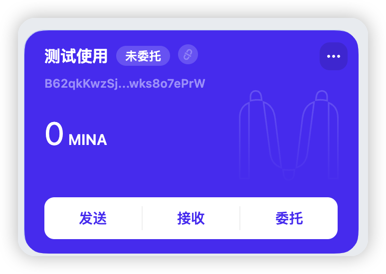

#### 概述Mina所采用的证明系统(包括名称、特点)

名称 ：Kimchi

特点：
1. 无需可信化的设置
2. 支持递归零知识证明
3. 通用的零知识证明协议
4. 小体积

#### 概述递归零知识证明在 Mina 共识过程中的应用

新加入的验证节点，只需要验证最新的区块 proof，就可以验证合法性

#### 下载安装 Auro wallet，创建账户，并完成领水

账号截图：

领水 tx hash:   [5JuWr9tSyPbCWhHsQsaTGE8bieogFoXXgrgNDNTfskSvcw9EP7Ly](https://minascan.io/devnet/tx/5JuWr9tSyPbCWhHsQsaTGE8bieogFoXXgrgNDNTfskSvcw9EP7Ly)