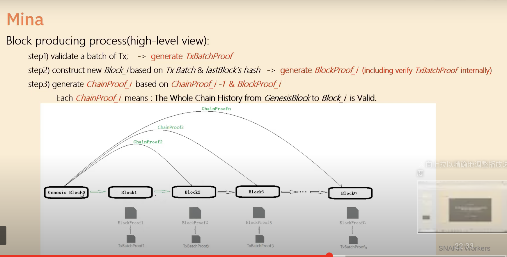
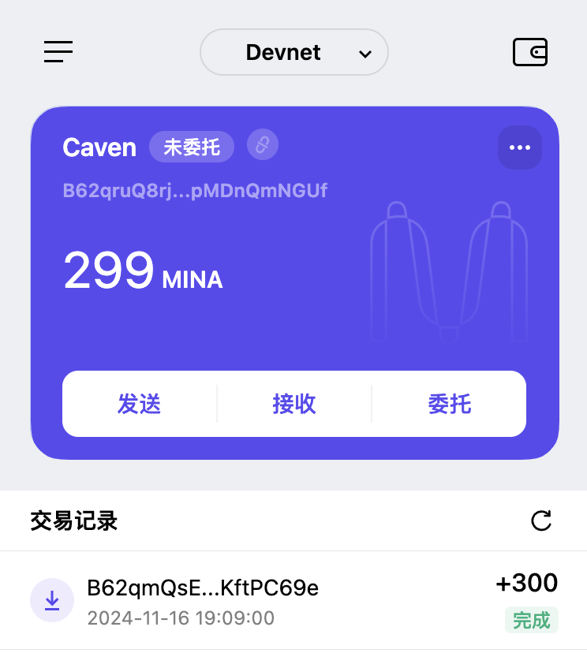

# Task1 

## 概述 Mina 所采用的证明系统(包括名称、特点)

Pickles 是 Mina 的证明系统，可以创建递归证明，它依赖于一个名为 Kimchi 的协议来生成证明。

主要特点:

- 可以验证其他 SNARK 证明的有效性
- 支持证明的组合和压缩
- 保持固定大小的证明

- 实现了批处理证明功能
- 支持证明的并行化处理
- 优化了递归证明的压缩率

- 基于离散对数假设
- 采用可信设置
- 实现了零知识特性

- 支持自定义电路约束
- 可扩展的证明系统架构
- 适应不同的应用场景

## 概述递归零知识证明在 Mina 共识过程中的应用

1. 验证一批交易, 生成交易批次证明
2. 构建新区块, 基于交易批次和上一个区块的哈希,生成区块证明 i
3. 生成链证明 i, 基于前一个链证明和当前区块证明

每个链证明代表：从创世区块到区块_i 的整个链历史都是有效的

## 下载安装 Auro wallet，创建账户，并完成领水

**Tx Hash**: `5JvLJ4guiS9yYZe6EexrdxTNwg255TMDWcDUf1QSQ1y2yMUp83Uk`

