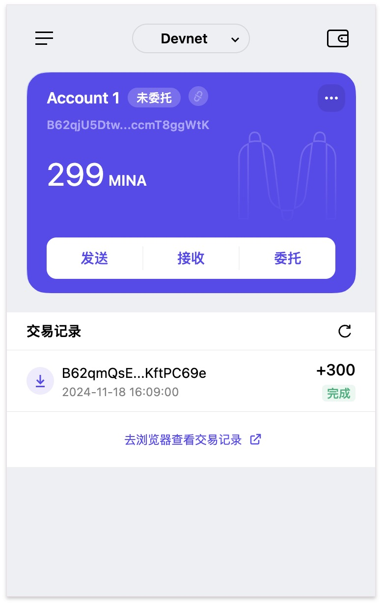

### task1：创建 auro wallet 账户，完成水龙头领水

1. 概述Mina所采用的证明系统(包括名称、特点)

    名称: zk-SNARKs

    特点: 
   - 零知识（Zero-Knowledge）
   - 简洁性（Succinct）
   - 非交互性（Non-Interactive）
   - 高效验证（Efficient Verification）

2. 概述递归零知识证明在 Mina 共识过程中的应用
    在 Mina 中，递归零知识证明 是实现轻量化区块链的核心技术。通过压缩区块链历史状态，递归 zk-SNARKs 不仅降低了存储和验证成本，还显著提升了系统的扩展性和安全性。结合其高效性和隐私保护特性，Mina 为去中心化应用和 Web3 提供了一种全新的技术范式。

3. 下载安装 [Auro wallet](https://www.aurowallet.com/download/)，创建账户，并完成[领水](https://faucet.minaprotocol.com/)

    tx hash: 5Juefc6hK7xo5NMkrdcErMkC1oVCGbhC8ehFoU9taM31oGhJvcGD

    

