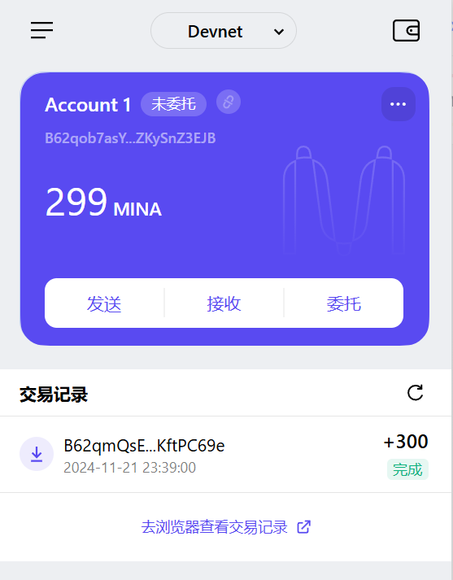

# task1：创建 auro wallet 账户，完成水龙头领水
1. 概述Mina所采用的证明系统(包括名称、特点)

- 证明系统:zk-SNARK，采用了 Groth16 作为其证明系统。
- 特点:简洁性、零知识、非交互性、可递归性、安全性

2. 概述递归零知识证明在 Mina 共识过程中的应用

- 区块链的压缩
- 轻量级节点的快速验证
- 降低储存需求
- 去中心化和安全性
- 快速链同步

## 请提交回答，钱包账户截图和领水 `tx hash`。

tx hash: ` 5JuEooTRiq9B6zhHKGAcMKSqf7KNmeXwirnhtJacHkoCGt8RAj6S`

