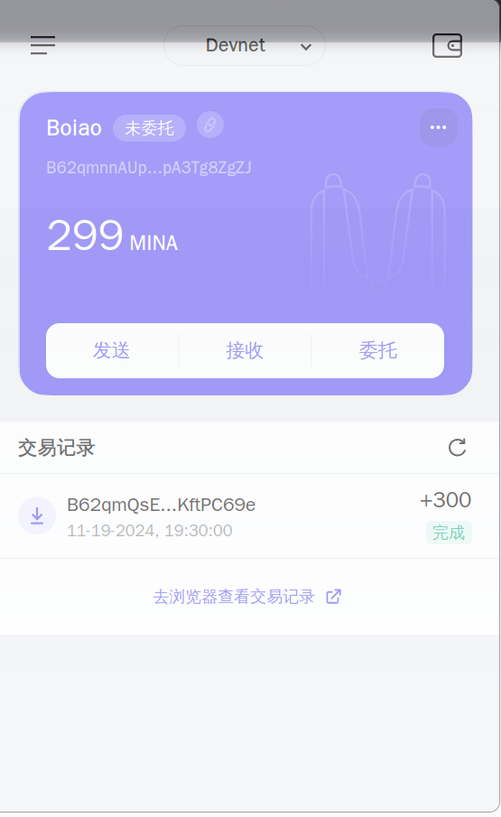

## 概述Mina所采用的证明系统(包括名称、特点)

#### 名称
零知识递归零知识证明

zkSNARK(**z**ero-**k**nowledge **S**uccinct **N**on-interactive **AR**gument on **K**nowledge)

中文翻译: 零知识简洁的非交互式知识论证

#### 特点

- 简化可信设置
- 递归性
- 简洁性

## 概述递归零知识证明在 Mina 共识过程中的应用

- 节点无需验证完整的历史，仅需验证最新的zkSNARK证明即可
- 数据量传输小，节点之间同步更快，验证更加快速
- 门槛低，降低了设备节点的要求，大大的降低了中心化的程度

## 截图和领水

`tx hash:` 5JuTYTekQ2jdJQTk2mdPVW5RbdAmsWP7qKJZBvMLCMaExuhjky6G
