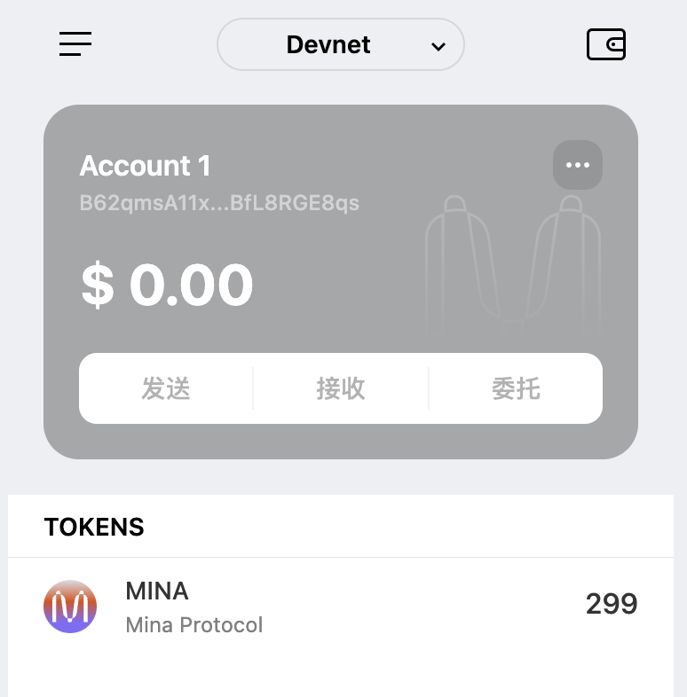

## 学习笔记
### 零知识证明
允许互不信任的通信双方之间证明某个命题的有效性，同时不泄露任何隐私信息。

### mina为什么只需要22kb
 递归验证的特点，只需要验证一次最新的区块，即可得到证明结果

## 账户分类
- 合约账户
- 用户账户

**领水：**`tx hash`：5JupA41sF6VnPr3ZxtGzrd45qV6fwDhAPEx2pKc7ooqSCw6RZNpK

钱包截图： 