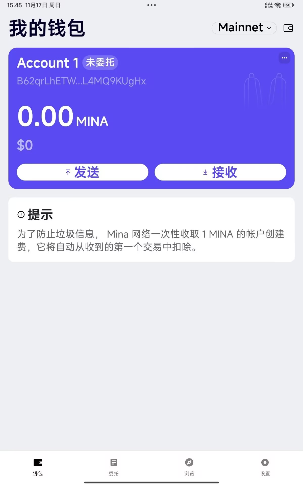

### task1：创建 auro wallet 账户，完成水龙头领水

### 1. 概述Mina所采用的证明系统(包括名称、特点)

####    Mina 使用的证明系统是 zh-SNARKs(更具体的是Kimchi)，利用了 zk-SNARK 的递归特性，将其扩展为一种适用于轻量级区块链的创新解决方案

####    zk-SNARK 的核心特点
        零知识性（Zero-Knowledge）
        证明者可以向验证者证明某件事为真，而无需透露任何输入的实际数据。

        在 Mina 中，交易或区块的有效性可以通过 zk-SNARK 证明，而不需要公开所有交易细节，从而增强隐私性。

        简洁性（Succinctness）
        zk-SNARK 的证明文件非常小（通常只有几百字节），验证时间极快（毫秒级别）。

        在 Mina 中，简洁性是实现“恒定区块链大小”的关键，链的历史和状态都可以压缩到一个小的递归证明中。

        非交互性（Non-Interactive）
        证明过程无需多轮交互，证明者只需生成一次证明，验证者即可独立验证。

        非交互性使 Mina 的验证过程简单高效，适合在去中心化网络中使用。

        知识论证（Arguments of Knowledge）
        zk-SNARK 确保证明者不仅声称某件事为真，还能够证明自己确实“知道”相关信息（例如，交易的私钥）。

        在 Mina 中保障了链上操作的可信性

        Mina 所用 zk-SNARK 的具体实现：Kimchi
        Mina 开发了一个自定义的 zk-SNARK 系统，名为 Kimchi，以满足其递归证明需求，具有以下特点：

        无需可信设置（Trustless Setup）
        大多数 zk-SNARK 系统需要“可信设置”（Trusted Setup）来生成安全参数，任何设置过程中的问题都会影响安全性。 Mina 实现了无需可信设置的递归证明系统，进一步增强了 Mina 的安全性和去中心化能力。

        支持无限递归
        高效地处理无限递归证明，确保区块链的历史增长不会导致性能下降。这是 Mina 实现恒定链大小的核心技术突破之一。

        优化的性能
        Pickles 对 zk-SNARK 算法进行了优化，使得证明生成和验证更加高效，适合实际区块链环境的高并发需求
### 2. 概述递归零知识证明在 Mina 共识过程中的应用

    递归零知识证明（RZKP）在 Mina 中扮演了核心角色，使 Mina 能够实现其轻量级区块链的独特特性。

##### 区块链的状态压缩
Mina 的设计目标是保持区块链大小恒定（约 22 KB），无论区块链的历史多么长。这一目标通过 RZKP 实现。

Mina 利用零知识证明技术（Kimchi, zk-SNARKs的一个变种），为每个新区块生成一个证明，证明新区块的有效性（包含交易、状态更新和共识过程）。

每个新区块不仅包含自己的有效性证明，还递归地包含前一区块的证明，形成了一条“证明的证明链”

最终，整个区块链的历史和状态被压缩为一个单一的零知识证明，而无需每个节点存储完整的区块链历史

##### 共识过程的验证效率
RZKP 的递归特性使得验证整个链的有效性变得非常高效：

节点只需要验证当前的递归证明，而不是从创世块开始验证每笔交易的有效性。

显著降低了参与网络的门槛，任何设备，包括手机或轻量级设备，都可以轻松成为 Mina 网络的节点

#### 隐私保护和数据完整性
Mina 的零知识证明还保障了交易的隐私和数据完整性

使用零知识技术，可以证明某些计算或状态更新是正确的，而无需透露计算的输入细节。

对于保护用户隐私和减少链上存储的数据量至关重要

#### 去中心化和可扩展性
每个参与者仅需下载和验证单个递归证明

Mina 保持了去中心化，允许更多用户运行完整节点而无需昂贵的硬件

可扩展性得以提升，网络负载不会随着链的增长而显著增加

### 3. 下载安装 [Auro wallet](https://www.aurowallet.com/download/)，创建账户，并完成[领水](https://faucet.minaprotocol.com/)

请提交回答，钱包账户截图和领水 `tx hash`。

tx hash: 5Ju9Vr7KJAVrbsrJ2XFFBmEaawRr3MVeLS59dNq1zbMXRCBRBr9a

