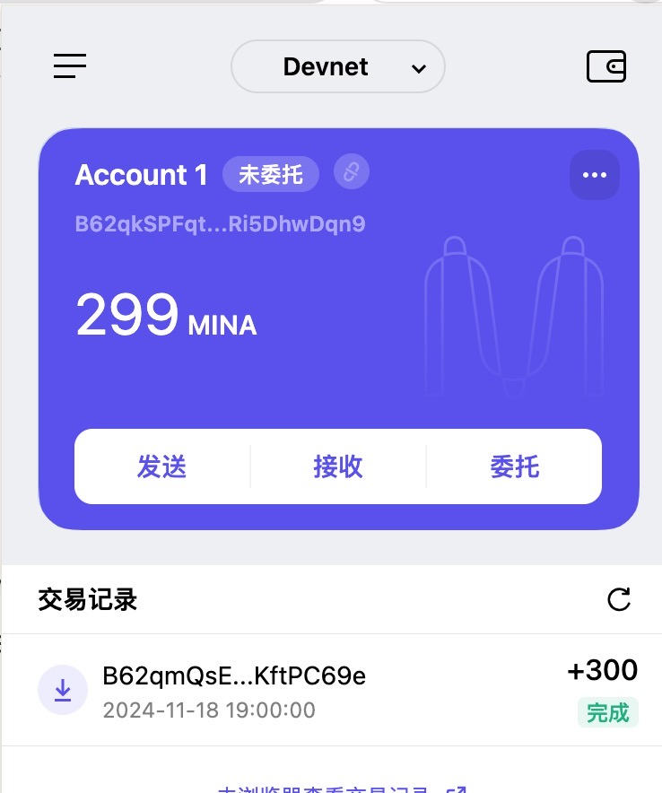

### task1：创建 auro wallet 账户，完成水龙头领水

1. 概述Mina所采用的证明系统(包括名称、特点)
    * 证明系统：zk-SNARK（零知识非交互式验证）
    * 特点：
        * 简化可信设置：简化了可信设置的过程，只需要全局设置一次，参数修改和应用升级不需要再次设置
        * 隐私：零知识证明的核心特性是在不泄露具体交易细节
        * 简洁：采用递归验证的方式，只需要证明一个proof的合法性
        * 高效：高效同步，减少传输宽带，毫秒级别验证，打开一个网页就可以验证
        * 轻量：只有22kb验证节点数据就等同于pow的整个区块链数据验证，是全世界最小的区块账单
        * 安全：mina大大减少了入门难度，更多人可以参与进来，更去中心化

2. 概述递归零知识证明在 Mina 共识过程中的应用
    * 验证前面交易集合的合法性，生成 `ganerate txBatchProof`
    * 基于前面的txBatchProof和最后一个区块的hash生成`ganerate batchProof_i`
    * 基于`batchProof_i-1`和`blockProof_i`生成`ChainProof_i`
    * 每个`ChainProof_i`就代表着所有历史的block被验证了

3. 下载安装 [Auro wallet](https://www.aurowallet.com/download/)，创建账户，并完成[领水](https://faucet.minaprotocol.com/)
    * 
    * tx hash: `5Ju2uitgggeSJuasr53YtnwFRH2mKBiP8BU9inTCPbDQrWQBozjz`
