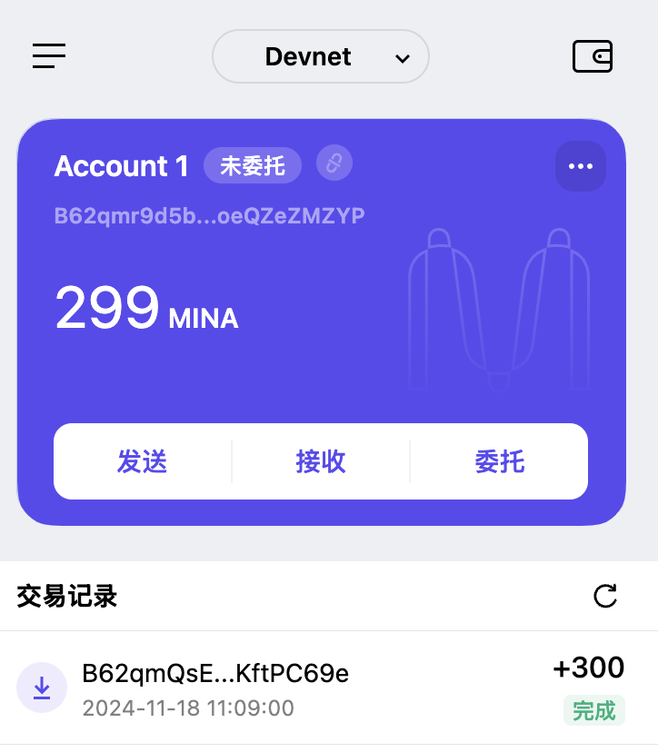
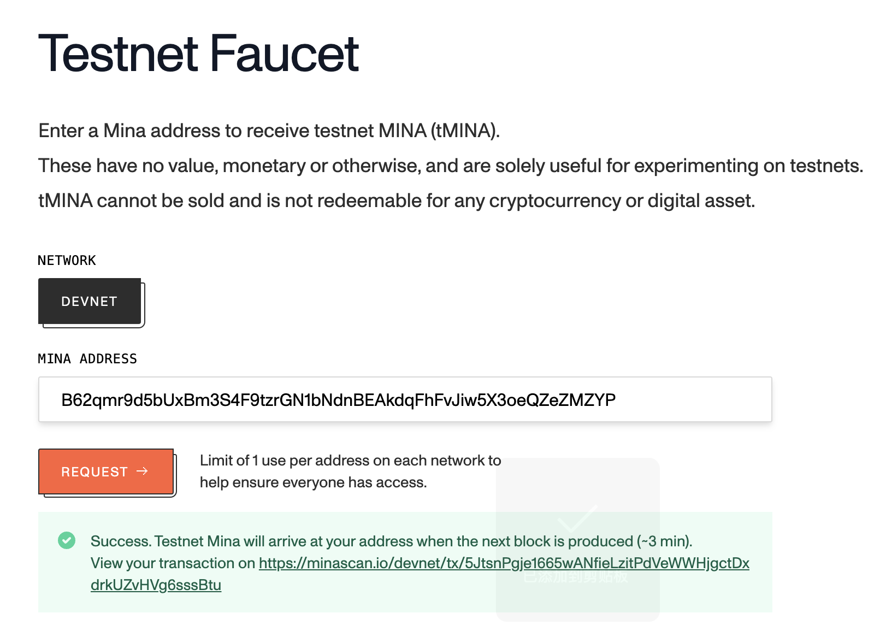

### task1：创建 auro wallet 账户，完成水龙头领水

1. 概述Mina所采用的证明系统(包括名称、特点)

> Mina 是一个轻量级的区块链协议，它采用了一种独特的证明系统 —— 零知识证明，特别是递归零知识证明。

- 名称：
    * 零知识证明（Zero-Knowledge Proof，ZKP），具体为递归零知识证明（Recursive Zero-Knowledge Proof）。
- 特点：
    * 简洁性：递归零知识证明允许将多个证明压缩成一个单一的、固定大小的证明。无论区块链的长度或交易数量如何增长，验证者只需验证一个相对较小的证明，大大降低了存储和验证成本。
    * 隐私性：零知识证明的核心特性是在不泄露具体交易细节的情况下，证明某个陈述是真实的。在 Mina 中，这意味着参与者可以验证交易的有效性，而无需知道交易的具体内容，从而保护了用户的隐私。
    * 高效性：通过递归证明技术，Mina 能够快速生成和验证证明，提高了区块链的共识效率，使得交易能够更快地被确认和记录在链上。
    * 可验证性：尽管证明过程是简洁的，但它仍然具有高度的可验证性。其他节点可以通过验证递归零知识证明来确保交易的合法性和区块链状态的一致性，增强了整个网络的安全性和可信度。

2. 概述递归零知识证明在 Mina 共识过程中的应用

- 区块生成：在 Mina 中，每个区块的生成者需要创建一个包含该区块内所有交易有效性证明的递归零知识证明。这个证明不仅涵盖了当前区块的交易，还包括了对之前所有区块状态的验证，从而确保了整个区块链历史的一致性。
- 共识验证：网络中的其他节点在验证新区块时，只需验证这个单一的递归零知识证明，而无需重新验证整个区块链的历史交易。这大大减少了验证时间和资源消耗，使得共识过程更加高效。
- 状态更新：递归零知识证明还用于更新区块链的全局状态。通过验证证明，节点可以快速确定新的区块链状态，而无需重新计算整个状态转换过程，提高了系统的可扩展性和响应速度。
- 增强隐私性：在共识过程中，由于递归零知识证明不需要暴露具体的交易信息，参与者只能验证证明的有效性，而无法获取交易的详细内容，从而为用户提供了更强的隐私保护。这对于一些对隐私要求较高的应用场景，如金融交易、个人数据存储等，具有重要意义。

3. 下载安装 [Auro wallet](https://www.aurowallet.com/download/)，创建账户，并完成[领水](https://faucet.minaprotocol.com/)

请提交回答，钱包账户截图和领水 `tx hash`。

- 
- 
- txhash: [5JtsnPgje1665wANfieLzitPdVeWWHjgctDxdrkUZvHVg6sssBtu](https://minascan.io/devnet/tx/5JtsnPgje1665wANfieLzitPdVeWWHjgctDxdrkUZvHVg6sssBtu)

