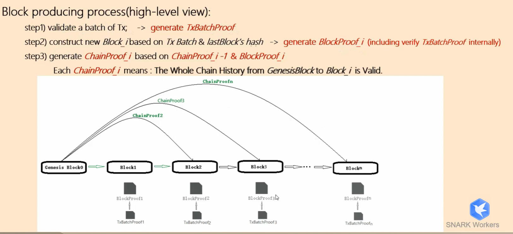
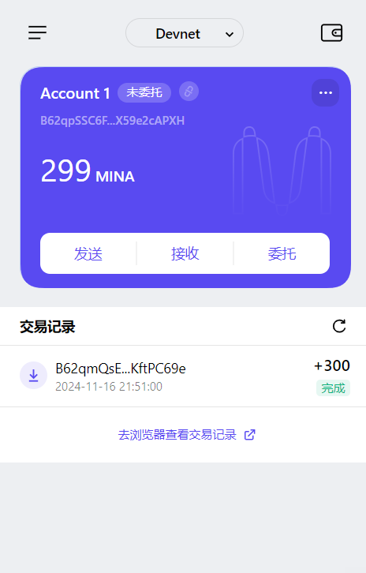

1. Mina所采用的证明系统
名称：非交互式零知识证明 / zkSNARK / PLONK / Kimchi

特点：
- simplified trusted setup
- recursion zkSNARK
- small proof size

----- 

2. 递归零知识证明

We assume that $ Block_i $ is being generated.
- a batch of transactions --> $ TxProof_i $
- $ TxProof_i  + hash(Block_{i-1}) $ --> $ BlockProof_i $   
    verify the $ TxProof_i $ internally
- $ ChainProof_{i-1} + BlockProof_i $ --> $ ChainProof_i $
- $ GenesisBlock + Block_1 $ --> $  ChainProof_1 $

$  ChainProof_1 $ means that the whole chain from the genesis block to $ Block_i $ is valid !

---

3. 创建账户并且领水
- tx hash: 5JuRJ4UosTFtph9taXj3jMVxJhqNsoxwXESEmUq2sRT5JKsNv5KK

