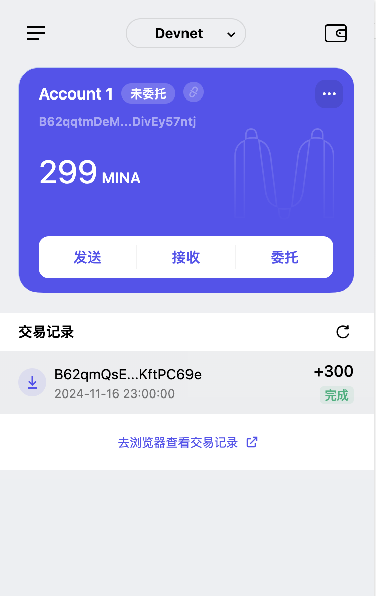

### task1：创建 auro wallet 账户，完成水龙头领水

1. 概述Mina所采用的证明系统(包括名称、特点)

    答：Mina采用递归zkSNARK，每一个节点只需要验证验证当前节点的正确性，就可以证明前面所有交易的正确性，从而大大减少了验证的复杂度。而原来的区块链必须从头开始溯源每一笔交易的合法性从而证明当前节点是合法的，显然对比起来 Mina 所采用的方法大大提高了效率，并且 Mina 只需要 22kb 就能够验证所有交易。

2. 概述递归零知识证明在 Mina 共识过程中的应用

    答：递归零知识证明在Mina共识过程中的应用主要体现在验证交易的正确性，即验证交易是否合法，是否满足Mina的共识规则。

3. 下载安装 [Auro wallet](https://www.aurowallet.com/download/)，创建账户，并完成[领水](https://faucet.minaprotocol.com/)

    请提交回答，钱包账户截图和领水 `tx hash`。
    答：5JvS6tU9TnpLX7PB8Gmgb5UZQYGe6AZY38PXo1tsrmsWvX3EmZLS
    

