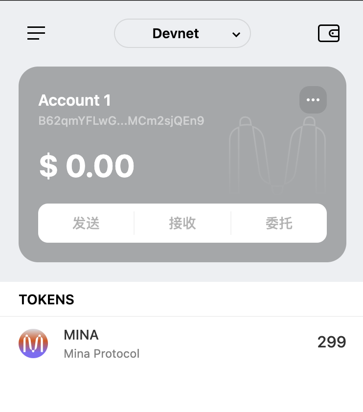

# task1：创建 auro wallet 账户，完成水龙头领水

## 概述Mina所采用的证明系统(包括名称、特点)

Mina协议采用Kimchi证明系统，这是PLONK算法在zkSNARK体系中的一个优化变体。其核心特性如下：

1. **无需可信设置**：相较于传统zkSNARK实现和Groth16需要复杂的可信设置仪式，Kimchi完全消除了这一要求，从而提升了系统安全性和部署效率。

2. **递归零知识证明**：通过实现递归型零知识证明机制，显著优化了链上验证开销，提高了计算效率，同时保持了区块链存储的轻量化。

3. **通用型零知识框架**：Mina的证明系统采用通用设计理念，具有较强的应用场景适应性和扩展性。

4. **优化的证明规模**：虽然证明大小略大于Groth16，但Kimchi生成的证明仍然保持了高度的紧凑性和实用性。

## 概述递归零知识证明在 Mina 共识过程中的应用

在Mina的权益证明（PoS）共识机制中，递归零知识证明主要服务于两个核心目标：

1. **网络通信优化**
2. **节点存储效率提升**

在构建新区块（Block_i）时，系统会生成：
- 单个区块证明（Proof_i）
- 涵盖从创世区块（Block_0）到前一区块（Block_i-1）的链证明（ChainProof_i）

这种证明架构消除了逐个验证历史区块的需求，大幅降低了网络通信开销和节点存储需求。

## 下载安装 [Auro wallet](https://www.aurowallet.com/download/)，创建账户，并完成[领水](https://faucet.minaprotocol.com/)

### 钱包账户截图

### 领水记录
https://minascan.io/devnet/tx/5JtsrnAE5RCs1fAh9k1hnTccrtYuDRvijJwK9daX5PWr1Vvf28Rr

### 领水 `tx hash` 
5JtsrnAE5RCs1fAh9k1hnTccrtYuDRvijJwK9daX5PWr1Vvf28Rr
