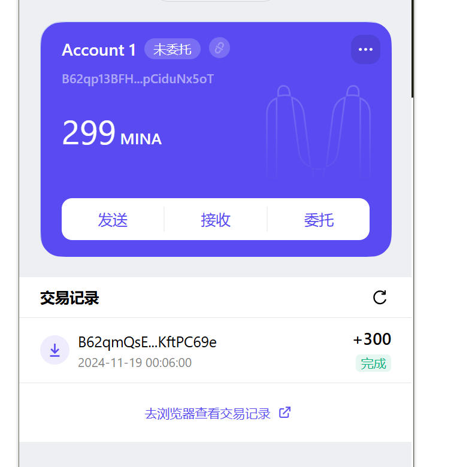

### task1：创建 auro wallet 账户，完成水龙头领水

1. 概述Mina所采用的证明系统(包括名称、特点)
2. 概述递归零知识证明在 Mina 共识过程中的应用
3. 下载安装 [Auro wallet](https://www.aurowallet.com/download/)，创建账户，并完成[领水](https://faucet.minaprotocol.com/)

请提交回答，钱包账户截图和领水 `tx hash`。

### 概述 Mina 所采用的证明系统(包括名称、特点)

zkSNARK (Zero-Knowledge Succinct Non-Interactive Argument of Knowledge) 是一种零知识证明系统，它允许证明者向验证者证明某个陈述是真实的，而无需透露任何关于陈述的额外信息。
PLONK 家族 -> Mina(Kimchi)

特点：
- 简化可信设置 simplified trusted setup
- 递归零知识证明
- general-purpose ?
- small proof size

### 概述递归零知识证明在 Mina 共识过程中的应用

- 仅需要 22kb 大小的证明就可以验证整个区块链的状态 
- 每一个新节点的加入，不需要下载全部并且重播所有的区块及其交易来重建账本，只需要下载最新的区块，就可以在毫秒级验证账本合法性
- 低资源需求
- 高效同步

### 下载安装 [Auro wallet](https://www.aurowallet.com/download/)，创建账户，并完成[领水](https://faucet.minaprotocol.com/)

tx hash:
5JtdMV6wEyayabWsoQF22eUAhxKkXCi5r3rFLFw1PknVdjG5oxDf